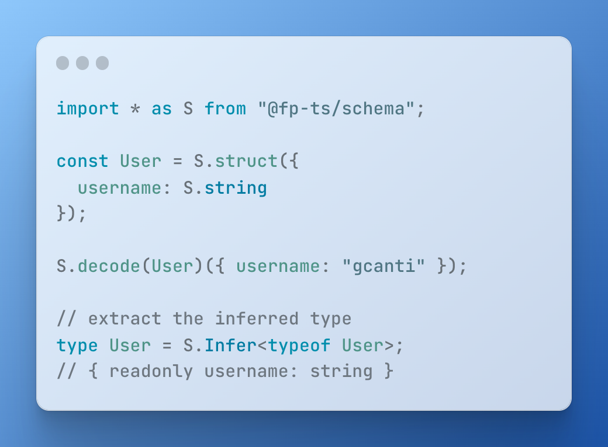

<h3 align="center">
  <a href="https://fp-ts.github.io/schema/">
    
  </a>
</h3>

<p align="center">
Modeling the schema of data structures as first-class values
</p>

<p align="center">
  <a href="https://www.npmjs.com/package/@fp-ts/schema">
    
  </a>
</p>

# Introduction

Welcome to the documentation for `@fp-ts/schema`, **a library for defining and using schemas** to validate and transform data in TypeScript.

`@fp-ts/schema` allows you to define a `Schema` that describes the structure and data types of a piece of data, and then use that `Schema` to perform various operations such as **decoding** from `unknown`, **encoding** to `unknown`, **verifying** that a value conforms to a given `Schema`.

`@fp-ts/schema` also provides a number of other features, including the ability to derive various artifacts such as `Arbitrary`s, `JSONSchema`s, and `Pretty`s from a `Schema`, as well as the ability to customize the library through the use of custom artifact compilers and custom `Schema` combinators.

If you're eager to learn how to define your first schema, jump straight to the [**Basic usage**](https://github.com/fp-ts/schema#basic-usage) section!

# Credits and sponsorship

This library was inspired by the following projects:

- [io-ts](https://github.com/gcanti/io-ts)
- [zod](https://github.com/colinhacks/zod)
- [zio-schema](https://github.com/zio/zio-schema)

A huge thanks to my sponsors who made the development of `@fp-ts/schema` possible.

If you also want to **become a sponsor** to ensure this library continues to improve and receive maintenance, check out my [GitHub Sponsors profile](https://github.com/sponsors/gcanti?o=sd&sc=t)

## Requirements

- TypeScript 4.7 or newer
- The `strict` flag enabled in your `tsconfig.json` file
- The `exactOptionalPropertyTypes` flag enabled in your `tsconfig.json` file

```
{
  // ...
  "compilerOptions": {
    // ...
    "strict": true,
    "exactOptionalPropertyTypes": true
  }
}
```

## Getting started

To install the **alpha** version:

```
npm install @fp-ts/schema
```

**Warning**. This package is primarily published to receive early feedback and for contributors, during this development phase we cannot guarantee the stability of the APIs, consider each release to contain breaking changes.

Once you have installed the library, you can import the necessary types and functions from the `@fp-ts/schema` module.

```ts
import * as S from "@fp-ts/schema";
```

## Defining a schema

To define a `Schema`, you can use the provided `struct` function to define a new `Schema` that describes an object with a fixed set of properties. Each property of the object is described by a `Schema`, which specifies the data type and validation rules for that property.

For example, consider the following `Schema` that describes a person object with a `name` property of type `string` and an `age` property of type `number`:

```ts
import * as S from "@fp-ts/schema";

const Person = S.struct({
  name: S.string,
  age: S.number,
});
```

You can also use the `union` function to define a `Schema` that describes a value that can be one of a fixed set of types. For example, the following `Schema` describes a value that can be either a `string` or a `number`:

```ts
const StringOrNumber = S.union(S.string, S.number);
```

In addition to the provided `struct` and `union` functions, `@fp-ts/schema` also provides a number of other functions for defining `Schema`s, including functions for defining arrays, tuples, and records.

## Extracting the inferred type

Once you have defined a `Schema`, you can use the `Infer` type to extract the inferred type of the data described by the `Schema`.

For example, given the `Person` `Schema` defined above, you can extract the inferred type of a `Person` object as follows:

```ts
interface Person extends S.Infer<typeof Person> {}
/*
interface Person {
  readonly name: string;
  readonly age: number;
}
*/
```

## Decoding

To use the `Schema` defined above to decode a value from `unknown`, you can use the `decode` function from the `@fp-ts/schema/Parser` module:

```ts
import * as S from "@fp-ts/schema";

const Person = S.struct({
  name: S.string,
  age: S.number,
});

const decodePerson = S.decode(Person);

const result1 = decodePerson({ name: "Alice", age: 30 });
if (S.isSuccess(result1)) {
  console.log(result1.right); // { name: "Alice", age: 30 }
}

const result2 = decodePerson(null);
if (S.isFailure(result2)) {
  console.log(result2.left); // [PR.type(..., null)]
}
```

The `decodePerson` function returns a value of type `ParseResult<A>`, which is a type alias for `Either<NonEmptyReadonlyArray<ParseError>, A>`, where `NonEmptyReadonlyArray<ParseError>` represents a list of errors that occurred during the decoding process and `A` is the inferred type of the data described by the `Schema`. A successful decode will result in a `Right`, containing the decoded data. A `Right` value indicates that the decode was successful and no errors occurred. In the case of a failed decode, the result will be a `Left` value containing a list of `ParseError`s.

The `decodeOrThrow` function is used to decode a value and throw an error if the decoding fails.
It is useful when you want to ensure that the value being decoded is in the correct format, and want to throw an error if it is not.

```ts
try {
  const person = P.decodeOrThrow(Person)({});
  console.log(person);
} catch (e) {
  console.error("Decoding failed:");
  console.error(e);
}
/*
Decoding failed:
1 error(s) found
└─ key "name"
   └─ is missing
*/
```

### Excess properties

When using a `Schema` to decode a value, any properties that are not specified in the `Schema` will result in a decoding error. This is because the `Schema` is expecting a specific shape for the decoded value, and any excess properties do not conform to that shape.

However, you can use the `isUnexpectedAllowed` option to allow excess properties while decoding. This can be useful in cases where you want to be permissive in the shape of the decoded value, but still want to catch any potential errors or unexpected values.

Here's an example of how you might use `isUnexpectedAllowed`:

```ts
import * as S from "@fp-ts/schema";

const Person = S.struct({
  name: S.string,
  age: S.number,
});

console.log(
  "%o",
  S.decode(Person)(
    {
      name: "Bob",
      age: 40,
      email: "bob@example.com",
    },
    { isUnexpectedAllowed: true }
  )
);
/*
{
  _tag: 'Right',
  right: { name: 'Bob', age: 40 }
}
*/
```

### All errors

The `allErrors` option is a feature that allows you to receive all decoding errors when attempting to decode a value using a schema. By default only the first error is returned, but by setting the `allErrors` option to `true`, you can receive all errors that occurred during the decoding process. This can be useful for debugging or for providing more comprehensive error messages to the user.

Here's an example of how you might use `allErrors`:

```ts
import * as S from "@fp-ts/schema";

const Person = S.struct({
  name: S.string,
  age: S.number,
});

console.log(
  "%o",
  S.decode(Person)(
    {
      name: "Bob",
      age: "abc",
      email: "bob@example.com",
    },
    { allErrors: true }
  )
);
/*
{
  _tag: 'Left',
  left: [
    {
      _tag: 'Key',
      key: 'age',
      errors: [
        { _tag: 'Type', expected: ..., actual: 'abc' },
        [length]: 1
      ]
    },
    {
      _tag: 'Key',
      key: 'email',
      errors: [
        { _tag: 'Unexpected', actual: 'bob@example.com' },
        [length]: 1
      ]
    },
    [length]: 2
  ]
}
*/
```

## Encoding

To use the `Schema` defined above to encode a value to `unknown`, you can use the `encode` function:

```ts
import * as S from "@fp-ts/schema";
import { pipe } from "@fp-ts/data/Function";
import { parseNumber } from "@fp-ts/schema/data/parser";

// Age is a schema that can decode a string to a number and encode a number to a string
const Age = pipe(S.string, parseNumber);

const Person = S.struct({
  name: S.string,
  age: Age,
});

const encoded = S.encode(Person)({ name: "Alice", age: 30 });
if (S.isSuccess(encoded)) {
  console.log(encoded.right); // { name: "Alice", age: "30" }
}
```

Note that during encoding, the number value `30` was converted to a string `"30"`.

## Formatting errors

To format errors when a `decode` or an `encode` function fails, you can use the `format` function from the `@fp-ts/schema/formatter/Tree` module.

```ts
import * as S from "@fp-ts/schema";
import { formatErrors } from "@fp-ts/schema/formatter/Tree";

const Person = S.struct({
  name: S.string,
  age: S.number,
});

const result = S.decode(Person)({});
if (S.isFailure(result)) {
  console.error("Decoding failed:");
  console.error(formatErrors(result.left));
}
/*
Decoding failed:
1 error(s) found
└─ key "name"
   └─ is missing
*/
```

## Assertions

The `is` function provided by the `@fp-ts/schema/Parser` module represents a way of verifying that a value conforms to a given `Schema`. `is` is a refinement that takes a value of type `unknown` as an argument and returns a `boolean` indicating whether or not the value conforms to the `Schema`.

```ts
import * as S from "@fp-ts/schema";

const Person = S.struct({
  name: S.string,
  age: S.number,
});

// const isPerson: (u: unknown) => u is Person
const isPerson = S.is(Person);

console.log(isPerson({ name: "Alice", age: 30 })); // true
console.log(isPerson(null)); // false
console.log(isPerson({})); // false
```

The `asserts` function takes a `Schema` and returns a function that takes an input value and checks if it matches the schema. If it does not match the schema, it throws an error with a comprehensive error message.

```ts
import * as S from "@fp-ts/schema";

const Person = S.struct({
  name: S.string,
  age: S.number,
});

// const assertsPerson: (input: unknown) => asserts input is Person
const assertsPerson: S.InferAsserts<typeof Person> = P.asserts(Person);

try {
  assertsPerson({ name: "Alice", age: "30" });
} catch (e) {
  console.error("The input does not match the schema:");
  console.error(e);
}
/*
The input does not match the schema:
Error: 1 error(s) found
└─ key "age"
   └─ Expected number, actual "30"
*/

// this will not throw an error
assertsPerson({ name: "Alice", age: 30 });
```

## [fast-check](https://github.com/dubzzz/fast-check) arbitraries

The `arbitrary` function provided by the `@fp-ts/schema/Arbitrary` module represents a way of generating random values that conform to a given `Schema`. This can be useful for testing purposes, as it allows you to generate random test data that is guaranteed to be valid according to the `Schema`.

```ts
import * as S from "@fp-ts/schema";
import * as A from "@fp-ts/schema/Arbitrary";
import * as fc from "fast-check";

const Person = S.struct({
  name: S.string,
  age: S.number,
});

const PersonArbitrary = A.arbitrary(Person)(fc);

console.log(fc.sample(PersonArbitrary, 2));
/*
[
{ name: '!U?z/X', age: -2.5223372357846707e-44 },
{ name: 'valukeypro', age: -1.401298464324817e-45 }
]
*/
```

## Pretty print

The `pretty` function provided by the `@fp-ts/schema/Pretty` module represents a way of pretty-printing values that conform to a given `Schema`.

You can use the `pretty` function to create a human-readable string representation of a value that conforms to a `Schema`. This can be useful for debugging or logging purposes, as it allows you to easily inspect the structure and data types of the value.

```ts
import * as S from "@fp-ts/schema";
import * as P from "@fp-ts/schema/Pretty";

const Person = S.struct({
  name: S.string,
  age: S.number,
});

const PersonPretty = P.pretty(Person);

// returns a string representation of the object
console.log(PersonPretty({ name: "Alice", age: 30 })); // `{ "name": "Alice", "age": 30 }`
```

# Basic usage

## Primitives

```ts
import * as S from "@fp-ts/schema";

// primitive values
S.string;
S.number;
S.bigint;
S.boolean;
S.symbol;
S.object;
S.json;
S.date; // value must be a Date

// empty types
S.undefined;
S.void; // accepts undefined

// catch-all types
// allows any value
S.any;
S.unknown;

// never type
// allows no values
S.never;
```

## Literals

```ts
S.null; // same as S.literal(null)
S.literal("a");
S.literal("a", "b", "c"); // union of literals
S.literal(1);
S.literal(2n); // bigint literal
S.literal(true);
```

## Template literals

The `templateLiteral` combinator allows you to create a schema for a TypeScript template literal type.

```ts
// $ExpectType Schema<`a${string}`>
S.templateLiteral(S.literal("a"), S.string);

// example from https://www.typescriptlang.org/docs/handbook/2/template-literal-types.html
const EmailLocaleIDs = S.literal("welcome_email", "email_heading");
const FooterLocaleIDs = S.literal("footer_title", "footer_sendoff");

// $ExpectType Schema<"welcome_email_id" | "email_heading_id" | "footer_title_id" | "footer_sendoff_id">
S.templateLiteral(S.union(EmailLocaleIDs, FooterLocaleIDs), S.literal("_id"));
```

## Filters

**Note**. Please note that the use of filters do not alter the type of the `Schema`. They only serve to add additional constraints to the decoding process.

### String filters

```ts
pipe(S.string, S.maxLength(5));
pipe(S.string, S.minLength(5));
pipe(S.string, nonEmpty()); // same as S.minLength(1)
pipe(S.string, S.length(5));
pipe(S.string, S.pattern(regex));
pipe(S.string, S.startsWith(string));
pipe(S.string, S.endsWith(string));
pipe(S.string, S.includes(searchString));
pipe(S.string, S.trimmed()); // verifies that a string contains no leading or trailing whitespaces
```

**Note**: The `trimmed` combinator does not make any transformations, it only validates. If what you were looking for was a combinator to trim strings, then check out the `trim` combinator.

### Number filters

```ts
pipe(S.number, S.greaterThan(5));
pipe(S.number, S.greaterThanOrEqualTo(5));
pipe(S.number, S.lessThan(5));
pipe(S.number, S.lessThanOrEqualTo(5));

pipe(S.number, S.int()); // value must be an integer

pipe(S.number, S.nonNaN()); // not NaN
pipe(S.number, S.finite()); // ensures that the value being decoded is finite and not equal to Infinity or -Infinity
```

## Native enums

```ts
enum Fruits {
  Apple,
  Banana,
}

// $ExpectType Schema<Fruits>
S.enums(Fruits);
```

## Nullables

```ts
// $ExpectType Schema<string | null>
S.nullable(S.string);
```

## Unions

```ts
// $ExpectType Schema<string | number>
S.union(S.string, S.number);
```

## Tuples

```ts
// $ExpectType Schema<readonly [string, number]>
S.tuple(S.string, S.number);
```

### Append a required element

```ts
// $ExpectType Schema<readonly [string, number, boolean]>
pipe(S.tuple(S.string, S.number), S.element(S.boolean));
```

### Append an optional element

```ts
// $ExpectType Schema<readonly [string, number, boolean?]>
pipe(S.tuple(S.string, S.number), S.optionalElement(S.boolean));
```

### Append a rest element

```ts
// $ExpectType Schema<readonly [string, number, ...boolean[]]>
pipe(S.tuple(S.string, S.number), S.rest(S.boolean));
```

## Arrays

```ts
// $ExpectType Schema<readonly number[]>
S.array(S.number);
```

### Non empty arrays

```ts
// $ExpectType Schema<readonly [number, ...number[]]>
S.nonEmptyArray(S.number);
```

## Structs

```ts
// $ExpectType Schema<{ readonly a: string; readonly b: number; }>
S.struct({ a: S.string, b: S.number });
```

### Optional fields

```ts
// $ExpectType Schema<{ readonly a: string; readonly b: number; readonly c?: boolean; }>
S.struct({ a: S.string, b: S.number, c: S.optional(S.boolean) });
```

## Pick

```ts
// $ExpectType Schema<{ readonly a: string; }>
pipe(S.struct({ a: S.string, b: S.number }), S.pick("a"));
```

## Omit

```ts
// $ExpectType Schema<{ readonly b: number; }>
pipe(S.struct({ a: S.string, b: S.number }), S.omit("a"));
```

## Partial

```ts
// $ExpectType Schema<Partial<{ readonly a: string; readonly b: number; }>>
S.partial(S.struct({ a: S.string, b: S.number }));
```

## Records

### String keys

```ts
// $ExpectType Schema<{ readonly [x: string]: string; }>
S.record(S.string, S.string);

// $ExpectType Schema<{ readonly a: string; readonly b: string; }>
S.record(S.union(S.literal("a"), S.literal("b")), S.string);
```

### Keys refinements

```ts
// $ExpectType Schema<{ readonly [x: string]: string; }>
S.record(pipe(S.string, S.minLength(2)), S.string);
```

### Symbol keys

```ts
// $ExpectType Schema<{ readonly [x: symbol]: string; }>
S.record(S.symbol, S.string);
```

### Template literal keys

```ts
// $ExpectType Schema<{ readonly [x: `a${string}`]: string; }>
S.record(S.templateLiteral(S.literal("a"), S.string), S.string);
```

## Extend

The `extend` combinator allows you to add additional fields or index signatures to an existing `Schema`.

```ts
// $ExpectType Schema<{ [x: string]: string; readonly a: string; readonly b: string; readonly c: boolean; }>
pipe(
  S.struct({ a: S.string, b: S.string }),
  S.extend(S.struct({ c: S.boolean })), // <= you can add more fields
  S.extend(S.record(S.string, S.string)) // <= you can add index signatures
);
```

## InstanceOf

In the following section, we demonstrate how to use the `instanceOf` combinator to create a `Schema` for a class instance.

```ts
class Test {
  constructor(readonly name: string) {}
}

// $ExpectType Schema<Test>
pipe(S.object, S.instanceOf(Test));
```

## Recursive types

The `lazy` combinator is useful when you need to define a `Schema` that depends on itself, like in the case of recursive data structures. In this example, the `Category` schema depends on itself because it has a field `subcategories` that is an array of `Category` objects.

```ts
interface Category {
  readonly name: string;
  readonly subcategories: ReadonlyArray<Category>;
}

const Category: S.Schema<Category> = S.lazy(() =>
  S.struct({
    name: S.string,
    subcategories: S.array(Category),
  })
);
```

Here's an example of two mutually recursive schemas, `Expression` and `Operation`, that represent a simple arithmetic expression tree.

```ts
interface Expression {
  readonly type: "expression";
  readonly value: number | Operation;
}

interface Operation {
  readonly type: "operation";
  readonly operator: "+" | "-";
  readonly left: Expression;
  readonly right: Expression;
}

const Expression: S.Schema<Expression> = S.lazy(() =>
  S.struct({
    type: S.literal("expression"),
    value: S.union(S.number, Operation),
  })
);

const Operation: S.Schema<Operation> = S.lazy(() =>
  S.struct({
    type: S.literal("operation"),
    operator: S.union(S.literal("+"), S.literal("-")),
    left: Expression,
    right: Expression,
  })
);
```

## Transformations

In some cases, we may need to transform the output of a schema to a different type. For instance, we may want to parse a string into a number, or we may want to transform a date string into a `Date` object.

To perform these kinds of transformations, the `@fp-ts/schema` library provides the `transform` and `transformOrFail` combinators.

The `transform` combinator takes a target schema, a transformation function from the source type to the target type, and a reverse transformation function from the target type back to the source type. It returns a new schema that applies the transformation function to the output of the original schema before returning it. If the original schema fails to decode a value, the transformed schema will also fail.

```ts
import * as S from "@fp-ts/schema";

// define a schema for the string type
const stringSchema: S.Schema<string> = S.string;

// define a schema for a tuple with one element of type string
const tupleSchema: S.Schema<[string]> = S.tuple(S.string);

// define a function that converts a string into a tuple with one element of type string
const decode = (s: string): [string] => [s];

// define a function that converts a tuple with one element of type string into a string
const encode = ([s]: [string]): string => s;

// use the transform combinator to convert the string schema into the tuple schema
const transformedSchema: S.Schema<[string]> = pipe(
  stringSchema,
  S.transform(tupleSchema, decode, encode)
);
```

In the example above, we defined a schema for the `string` type and a schema for the tuple type `[string]`. We also defined the functions `decode` and `encode` that convert a `string` into a tuple and a tuple into a `string`, respectively. Then, we used the `transform` combinator to convert the string schema into a schema for the tuple type `[string]`. The resulting schema can be used to decode values of type `string` into values of type `[string]`.

The `transformOrFail` combinator works in a similar way, but allows the transformation function to return a `ParseResult` object, which can either be a success or a failure.

Here's an example of the `transformOrFail` combinator which converts a `string` into a `boolean`:

```ts
import { pipe } from "@fp-ts/data/Function";
import * as PR from "@fp-ts/schema/ParseResult";
import * as S from "@fp-ts/schema";
import * as AST from "@fp-ts/schema/AST";

// define a schema for the string type
const stringSchema: S.Schema<string> = S.string;

// define a schema for the boolean type
const booleanSchema: S.Schema<boolean> = S.boolean;

// define a function that converts a string into a boolean
const decode = (s: string): PR.ParseResult<boolean> =>
  s === "true"
    ? PR.success(true)
    : s === "false"
    ? PR.success(false)
    : PR.failure(
        PR.type(AST.union([AST.literal("true"), AST.literal("false")]), s)
      );

// define a function that converts a boolean into a string
const encode = (b: boolean): ParseResult<string> => PR.success(String(b));

// use the transformOrFail combinator to convert the string schema into the boolean schema
const transformedSchema: S.Schema<boolean> = pipe(
  stringSchema,
  S.transformOrFail(booleanSchema, decode, encode)
);
```

### parseNumber

Transforms a `string` into a `number` by parsing the string using `parseFloat`.

The following special string values are supported: "NaN", "Infinity", "-Infinity".

```ts
import * as S from "@fp-ts/schema";
import { parseNumber } from "@fp-ts/schema/data/parser";

const schema = parseNumber(S.string);
const decodeOrThrow = S.decodeOrThrow(schema);

// success cases
decodeOrThrow("1"); // 1
decodeOrThrow("-1"); // -1
decodeOrThrow("1.5"); // 1.5
decodeOrThrow("NaN"); // NaN
decodeOrThrow("Infinity"); // Infinity
decodeOrThrow("-Infinity"); // -Infinity

// failure cases
decodeOrThrow("a"); // throws
```

### trim

The `trim` parser allows removing whitespaces from the beginning and end of a string.

```ts
import * as S from "@fp-ts/schema";

const schema = S.trim(S.string);
const decodeOrThrow = S.decodeOrThrow(schema);

decodeOrThrow("a"); // "a"
decodeOrThrow(" a"); // "a"
decodeOrThrow("a "); // "a"
decodeOrThrow(" a "); // "a"
```

**Note**. If you were looking for a combinator to check if a string is trimmed, check out the `trimmed` combinator.

### parseDate

Transforms a `string` into a `Date` by parsing the string using `Date.parse`.

```ts
import * as S from "@fp-ts/schema";
import { parseDate } from "@fp-ts/schema/data/parser";

const schema = parseDate(S.string);
const decodeOrThrow = S.decodeOrThrow(schema);

decodeOrThrow("1970-01-01T00:00:00.000Z"); // new Date(0)

decodeOrThrow("a"); // throws
```

## Option

The `option` combinator allows you to specify that a field in a schema may be either an optional value or `null`. This is useful when working with JSON data that may contain `null` values for optional fields.

In the example below, we define a schema for an object with a required `a` field of type `string` and an optional `b` field of type `number`. We use the `option` combinator to specify that the `b` field may be either a `number` or `null`.

```ts
import * as S from "@fp-ts/schema";
import * as O from "@fp-ts/data/Option";

const schema = S.struct({
  a: S.string,
  // define a schema for Option with number values
  b: S.option(S.number),
});
const decodeOrThrow = S.decodeOrThrow(schema);

decodeOrThrow({ a: "hello", b: null }); // { a: "hello", b: O.none }

decodeOrThrow({ a: "hello", b: 1 }); // { a: "hello", b: O.some(1) }
```

## ReadonlySet

In the following section, we demonstrate how to use the `fromValues` combinator to decode a `ReadonlySet` from an array of values.

```ts
import * as S from "@fp-ts/schema";
import { fromValues } from "@fp-ts/schema/data/ReadonlySet";

// define a schema for ReadonlySet with number values
const schema = fromValues(S.number);
const decodeOrThrow = P.decodeOrThrow(schema);

decodeOrThrow([1, 2, 3]); // new Set([1, 2, 3])
```

## ReadonlyMap

In the following section, we demonstrate how to use the `fromEntries` combinator to decode a `ReadonlyMap` from an array of entries.

```ts
import * as S from "@fp-ts/schema";
import { fromEntries } from "@fp-ts/schema/data/ReadonlyMap";

// define the schema for ReadonlyMap with number keys and string values
const schema = fromEntries(S.number, S.string);
const decodeOrThrow = P.decodeOrThrow(schema);

decodeOrThrow([
  [1, "a"],
  [2, "b"],
  [3, "c"],
]); // new Map([[1, "a"], [2, "b"], [3, "c"]])
```

# Adding new data types

The easiest way to define a new data type is through the `filter` combinator.

```ts
import * as S from "@fp-ts/schema";

const LongString = pipe(
  S.string,
  S.filter((s) => s.length >= 10, {
    message: () => "a string at least 10 characters long",
  })
);

console.log(S.decodeOrThrow(LongString)("a"));
/*
1 error(s) found
└─ Expected a string at least 10 characters long, actual "a"
*/
```

It is good practice to add as much metadata as possible so that it can be used later by introspecting the schema.

```ts
const LongString = pipe(
  S.string,
  S.filter((s) => s.length >= 10, {
    message: () => "a string at least 10 characters long",
    identifier: "LongString",
    jsonSchema: { minLength: 10 },
    description:
      "Lorem ipsum dolor sit amet, consectetur adipiscing elit, sed do eiusmod tempor incididunt ut labore et dolore magna aliqua",
  })
);
```

# Technical overview

## Understanding Schemas

A schema is a description of a data structure that can be used to generate various artifacts from a single declaration.

From a technical point of view a schema is just a typed wrapper of an `AST` value:

```ts
interface Schema<in out A> {
  readonly ast: AST;
}
```

The `AST` type represents a tiny portion of the TypeScript AST, roughly speaking the part describing ADTs (algebraic data types),
i.e. products (like structs and tuples) and unions.

This means that you can define your own schema constructors / combinators as long as you are able to manipulate the `AST` value accordingly, let's see an example.

Say we want to define a `pair` schema constructor, which takes a `Schema<A>` as input and returns a `Schema<readonly [A, A]>` as output.

First of all we need to define the signature of `pair`

```ts
import * as S from "@fp-ts/schema";

declare const pair: <A>(schema: S.Schema<A>) => S.Schema<readonly [A, A]>;
```

Then we can implement the body using the APIs exported by the `@fp-ts/schema/AST` module:

```ts
import * as S from "@fp-ts/schema";
import * as AST from "@fp-ts/schema/AST";
import * as O from "@fp-ts/data/Option";

const pair = <A>(schema: S.Schema<A>): S.Schema<readonly [A, A]> => {
  const element = AST.createElement(
    schema.ast, // <= the element type
    false // <= is optional?
  );
  const tuple = AST.createTuple(
    [element, element], // <= elements definitions
    O.none, // <= rest element
    true // <= is readonly?
  );
  return S.make(tuple); // <= wrap the AST value in a Schema
};
```

This example demonstrates the use of the low-level APIs of the `AST` module, however, the same result can be achieved more easily and conveniently by using the high-level APIs provided by the `Schema` module.

```ts
const pair = <A>(schema: S.Schema<A>): S.Schema<readonly [A, A]> =>
  S.tuple(schema, schema);
```

Please note that the `S.tuple` API is a convenient utility provided by the library, but it can also be easily defined and implemented in userland.

```ts
export const tuple = <Elements extends ReadonlyArray<Schema<any>>>(
  ...elements: Elements
): Schema<{ readonly [K in keyof Elements]: Infer<Elements[K]> }> =>
  makeSchema(
    AST.createTuple(
      elements.map((schema) => AST.createElement(schema.ast, false)),
      O.none,
      true
    )
  );
```

## Annotations

One of the fundamental requirements in the design of `@fp-ts/schema` is that it is extensible and customizable. Customizations are achieved through "annotations". Each node contained in the AST of `@fp-ts/schema/AST` contains an `annotations: Record<string | symbol, unknown>` field that can be used to attach additional information to the schema.

Let's see some examples:

```ts
import { pipe } from "@fp-ts/data/Function";
import * as S from "@fp-ts/schema";

const Password = pipe(
  // initial schema, a string
  S.string,
  // add an error message for non-string values (annotation)
  S.message(() => "not a string"),
  // add a constraint to the schema, only non-empty strings are valid
  S.nonEmpty,
  // add an error message for empty strings (annotation)
  S.message(() => "required"),
  // add a constraint to the schema, only strings with a length less or equal than 10 are valid
  S.maxLength(10),
  // add an error message for strings that are too long (annotation)
  S.message((s) => `${s} is too long`),
  // add an identifier to the schema (annotation)
  S.identifier("Password"),
  // add a title to the schema (annotation)
  S.title("password"),
  // add a description to the schema (annotation)
  S.description(
    "A password is a string of characters used to verify the identity of a user during the authentication process"
  ),
  // add examples to the schema (annotation)
  S.examples(["1Ki77y", "jelly22fi$h"]),
  // add documentation to the schema (annotation)
  S.documentation(`
    jsDoc documentation...
  `)
);
```

The example shows some built-in combinators to add meta information, but users can easily add their own meta information by defining a custom combinator.

Here's an example of how to add a `deprecated` annotation:

```ts
import * as S from "@fp-ts/schema";
import * as AST from "@fp-ts/schema/AST";
import { pipe } from "@fp-ts/data/Function";

const DeprecatedId = "some/unique/identifier/for/the/custom/annotation";

const deprecated = <A>(self: S.Schema<A>): S.Schema<A> =>
  S.make(AST.annotation(self.ast, DeprecatedId, true));

const schema = pipe(S.string, deprecated);

console.log(schema);
/*
{
  ast: {
    _tag: 'StringKeyword',
    annotations: {
      '@fp-ts/schema/annotation/TitleId': 'string',
      'some/unique/identifier/for/the/custom/annotation': true
    }
  }
}
*/
```

Annotations can be read using the `getAnnotation` helper, here's an example:

```ts
import * as O from "@fp-ts/data/Option";

const isDeprecated = <A>(schema: S.Schema<A>): boolean =>
  pipe(
    AST.getAnnotation<boolean>(DeprecatedId)(schema.ast),
    O.getOrElse(() => false)
  );

console.log(isDeprecated(S.string)); // false
console.log(isDeprecated(schema)); // true
```

# Documentation

- [API Reference](https://fp-ts.github.io/schema/)

# License

The MIT License (MIT)
