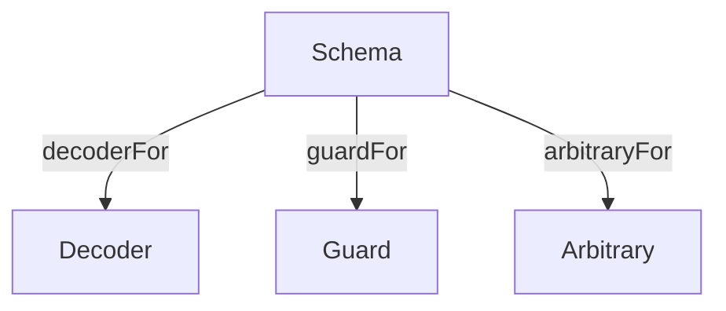

<h3 align="center">
  <a href="https://fp-ts.github.io/schema/">
    
  </a>
</h3>

<p align="center">
Schema validation with static type inference
</p>

<p align="center">
  <a href="https://www.npmjs.com/package/@fp-ts/schema">
    
  </a>
</p>



# Features

- Deriving (`Decoder`, `Guard`, `Arbitrary`)
- Custom interpreters
- Custom schema combinators
- Custom data types
- Custom decode errors
- Versioning (TODO)
- Migration (TODO)

# Schemas

Creating a schema

```ts
import * as S from "@fp-ts/schema/Schema";

const Person = S.struct({
  name: S.string,
  age: S.number,
});

// extract the inferred type
type Person = S.Infer<typeof Person>;
/*
type Person = {
    readonly name: string;
    readonly age: number;
}
*/
```

# Decoders

Deriving a decoder from a schema

```ts
import * as S from "@fp-ts/schema/Schema";
import * as D from "@fp-ts/schema/Decoder";
import * as DE from "@fp-ts/schema/DecodeError";

const schema = S.struct({
  name: S.string,
  age: S.number,
});

const decoder = D.decoderFor(schema);
/*
const decoder: D.Decoder<unknown, {
  readonly name: string;
  readonly age: number;
}>
*/

expect(decoder.decode({ name: "name", age: 18 })).toEqual(
  D.succeed({ name: "name", age: 18 })
);

expect(decoder.decode(null)).toEqual(
  D.fail(DE.notType("{ readonly [_: string]: unknown }", null))
);
```

# Guards

Deriving a guard from a schema

```ts
import * as S from "@fp-ts/schema/Schema";
import * as G from "@fp-ts/schema/Guard";

const schema = S.struct({
  name: S.string,
  age: S.number,
});

const guard = G.guardFor(schema);
/*
const decoder: G.Guard<{
  readonly name: string;
  readonly age: number;
}>
*/

expect(guard.is({ name: "name", age: 18 })).toEqual(true);
expect(guard.is(null)).toEqual(false);
```

# Arbitraries

Deriving an arbitrary from a schema

```ts
import * as S from "@fp-ts/schema/Schema";
import * as A from "@fp-ts/schema/Arbitrary";
import * as fc from "fast-check";

const schema = S.struct({
  name: S.string,
  age: S.number,
});

const arb = A.arbitraryFor(schema).arbitrary(fc);
/*
const arb: fc.Arbitrary<{
  readonly name: string;
  readonly age: number;
}>
*/

console.log(fc.sample(arb, 2));
/*
[
  { name: 't9dUS+\\Z', age: 3.4028228579130005e+38 },
  { name: 'o', age: -3.4028218437925203e+38 }
]
*/
```

# Custom interpreters

`src/Decoder.ts`, `src/Guard.ts` and `src/Arbitrary.ts` are good examples of defining a custom interpreter.

# Custom schema combinators

Examples in `/src/Schema.ts`.

All the combinators defined in `/src/Schema.ts` could be implemented in userland.

# Custom data types

Examples in `/src/data/*`

# Custom decode errors

```ts
import * as DE from "@fp-ts/schema/DecodeError";
import * as D from "@fp-ts/schema/Decoder";
import * as S from "@fp-ts/schema/Schema";
import { pipe } from "@fp-ts/data/Function";

const mystring = pipe(
  S.string,
  S.clone(Symbol.for("mystring"), {
    [D.DecoderId]: () => mystringDecoder,
  })
);

const mystringDecoder = D.make(mystring, (u) =>
  typeof u === "string"
    ? D.succeed(u)
    : D.fail(DE.custom({ myCustomErrorConfig: "not a string" }, u))
);

const Person = S.struct({
  name: mystring,
  age: S.number,
});

const decoder = D.decoderFor(Person);

decoder.decode({ name: null, age: 18 }); // => left(DE.custom({ myCustomErrorConfig: "not a string" }, null))
```

# Supported data types

|                      |                   | TypeScript                                                       | `AST`          |
| -------------------- | ----------------- | ---------------------------------------------------------------- | -------------- |
| Primitives           |                   |                                                                  |                |
|                      | strings           | `string`                                                         | `String`       |
|                      | numbers           | `number`                                                         | `Number`       |
|                      | booleans          | `boolean`                                                        | `Boolean`      |
| Literals             |                   |                                                                  |                |
|                      | string literals   | `"a"`                                                            | `Of`           |
|                      | number literals   | `1`                                                              | `Of`           |
|                      | boolean literals  | `true`                                                           | `Of`           |
| Enums                |                   |                                                                  |                |
|                      | numeric enums     | `enum Fruits { Apple, Banana }`                                  | `Of` + `Union` |
|                      | string enums      | `enum Fruits { Apple = "apple", Banana = "banana" }`             | `Of` + `Union` |
|                      | const enums       | `const Fruits = { Apple = "apple", Banana = "banana" } as const` | `Of` + `Union` |
| Objects              |                   |                                                                  |                |
|                      |                   | `{ a: string, b: number }`                                       | `Struct`       |
|                      | index signature   | `{ a: string, b: string, [_: string]: string }`                  | `Struct`       |
| Records              |                   |                                                                  |                |
|                      |                   | `{ [_: string]: number }`                                        | `Struct`       |
| Tuples               |                   |                                                                  |                |
|                      |                   | `[string, number]`                                               | `Tuple`        |
|                      | with rest element | `[string, number, ...boolean[]]`                                 | `Tuple`        |
| Arrays               |                   |                                                                  |                |
|                      |                   | `string[]`                                                       | `Tuple`        |
| Unions               |                   |                                                                  |                |
|                      |                   | `string \| number`                                               | `Union`        |
| Recursive data types |                   | `type A = { as: A[] }`                                           | `Lazy`         |

# Documentation

- [API Reference](https://fp-ts.github.io/schema/)

# License

The MIT License (MIT)
