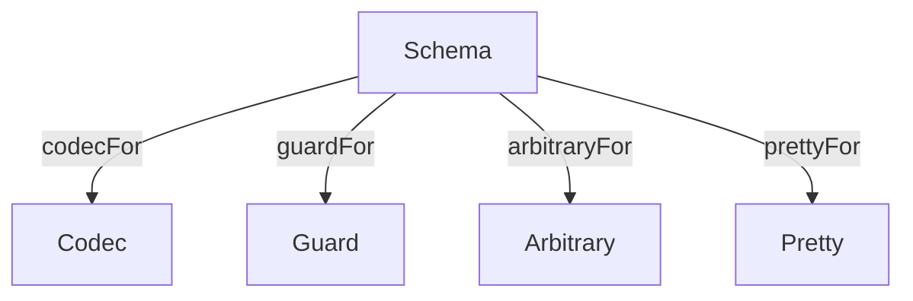

<h3 align="center">
  <a href="https://fp-ts.github.io/schema/">
    
  </a>
</h3>

<p align="center">
Schema validation with static type inference
</p>

<p align="center">
  <a href="https://www.npmjs.com/package/@fp-ts/schema">
    
  </a>
</p>



# Features

- deriving single artifacts from a `Schema`:
  - `Guard`
  - `Arbitrary`
  - `Pretty`
- `Codec` (all in one artifact)
- custom artifact compilers
- custom `Schema` combinators
- custom data types
- custom decode errors (TODO)
- refinements (TODO)
- versioning (TODO)
- migration (TODO)

# Introduction

Welcome to the documentation for `@fp-ts/schema`, a library for defining and using schemas to validate and transform data in TypeScript. `@fp-ts/schema` allows you to define a `Schema` that describes the structure and data types of a piece of data, and then use that `Schema` to perform various operations such as decoding from `unknown`, encoding to `unknown`, parsing from `JSON` strings, and stringifying to `JSON` strings. `@fp-ts/schema` also provides a number of other features, including the ability to derive various artifacts such as `Codec`s, `Guard`s, and `Arbitrary`s from a `Schema`, as well as the ability to customize the library through the use of custom artifact compilers and custom `Schema` combinators.

## Getting started

To get started with `@fp-ts/schema`, you will need to install the library using npm or yarn:

```
npm install @fp-ts/schema
```

```
yarn add @fp-ts/schema
```

Once you have installed the library, you can import the necessary types and functions from the `@fp-ts/schema/Codec` module.

```ts
import * as C from "@fp-ts/schema/Codec";
```

## Defining a schema

To define a `Schema`, you can use the provided `struct` function to define a new `Schema` that describes an object with a fixed set of properties. Each property of the object is described by a `Schema`, which specifies the data type and validation rules for that property.

For example, consider the following `Schema` that describes a person object with a `name` property of type `string` and an `age` property of type `number`:

```ts
const Person = C.struct({
  name: C.string,
  age: C.number,
});
```

You can also use the `union` function to define a `Schema` that describes a value that can be one of a fixed set of types. For example, the following `Schema` describes a value that can be either a `string` or a `number`:

```ts
const StringOrNumber = C.union(C.string, C.number);
```

In addition to the provided `struct` and `union` functions, `@fp-ts/schema` also provides a number of other functions for defining `Schema`s, including functions for defining arrays, tuples, and dictionaries.

## Extracting the inferred type

Once you have defined a `Schema`, you can use the `Infer` type to extract the inferred type of the data described by the `Schema`. For example, given the `Person` `Schema` defined above, you can extract the inferred type of a `Person` object as follows:

```ts
type Person = C.Infer<typeof Person>;
/*
type Person = {
  readonly name: string;
  readonly age: number;
}
*/
```

## Decoding from `unknown`

To use the `Person` `Schema` defined above to decode a value from `unknown`, you can use the `decode` function:

```ts
import * as DE from "@fp-ts/schema/DecodeError";

const unknown: unknown = { name: "name", age: 18 };

expect(Person.decode(unknown)).toEqual(C.success({ name: "name", age: 18 }));
expect(Person.decode(null)).toEqual(
  C.failure(DE.notType("{ readonly [x: string]: unknown }", null))
);
```

The `decode` function returns a `Validated<DecodeError, A>` which is a type alias for `These<NonEmptyReadonlyArray<DecodeError>, A>`, where `DecodeError` is a type that represents a list of decode errors and `A` is the inferred type of the `Schema`. If the result is a `Right` or a `Both` value, it means that the decode was successful and the value inside the `Right` is the decoded value. If the result is a `Left` value, it means that the decode failed and the value inside the `Left` is a list of decode errors.

## Parsing from JSON strings

To use the `Person` `Schema` defined above to parse a `JSON` string, you can use the `parse` function:

```ts
expect(() => Person.parseOrThrow("malformed")).toThrow(
  new Error("Cannot parse JSON from: malformed")
);
expect(() => Person.parseOrThrow("{}")).toThrow(
  new Error("Cannot decode JSON")
);

// with a custom formatter
expect(() =>
  Person.parseOrThrow("{}", (errors) => JSON.stringify(errors))
).toThrow(
  new Error(
    `Cannot decode JSON, errors: [{"_tag":"Key","key":"name","errors":[{"_tag":"Missing"}]}]`
  )
);
```

## Encoding a value

To use the `Person` `Schema` defined above to encode a value to `unknown`, you can use the `encode` function:

```ts
expect(Person.encode({ name: "name", age: 18 })).toEqual({
  name: "name",
  age: 18,
});
```

## Stringifying to JSON strings

To use the `Person` `Schema` defined above to stringify to a `JSON` string, you can use the `stringify` function:

```ts
expect(Person.stringify({ name: "name", age: 18 })).toEqual(
  '{"name":"name","age":18}'
);
```

Guard

```ts
expect(Person.is({ name: "name", age: 18 })).toEqual(true);
expect(Person.is(null)).toEqual(false);
```

Pretty print

```ts
expect(Person.pretty({ name: "name", age: 18 })).toEqual(
  `{ "name": "name", "age": 18 }`
);
```

[`fast-check`](https://github.com/dubzzz/fast-check) `Arbitrary`

```ts
import * as fc from "fast-check";

console.log(fc.sample(Person.arbitrary(fc), 2));
/*
[
{ name: '!U?z/X', age: -2.5223372357846707e-44 },
{ name: 'valukeypro', age: -1.401298464324817e-45 }
]
*/
```

# Custom artifact compilers

`src/Pretty.ts`, `src/Guard.ts` and `src/Arbitrary.ts` are good examples of defining a custom compiler.

# Custom schema combinators

Examples in `/src/Schema.ts`.

All the combinators defined in `/src/Schema.ts` could be implemented in userland.

# Custom data types

Examples in `/src/data/*`

# Understanding Schemas

A schema is a description of a data structure that can be used to generate various artifacts from a single declaration.

From a technical point of view a schema is just a typed wrapper of an `AST` value

```ts
interface Schema<in out A> {
  readonly ast: AST;
}
```

The `AST` type represents a tiny portion of the TypeScript AST, roughly speaking the part describing ADTs (algebraic data types),
i.e. products (like structs and tuples) and unions.

This means that you can define your own schema constructors / combinators as long as you are able to manipulate the `AST` type accordingly, let's see an example.

Say we want to define a `pair` schema constructor, which takes a `Schema<A>` as input and returns a `Schema<readonly [A, A]>` as output.

First of all we need to define the signature of `pair`

```ts
import * as S from "@fp-ts/schema/Schema";

declare const pair: <A>(schema: S.Schema<A>) => S.Schema<readonly [A, A]>;
```

Then we can implement the body using the APIs exported by the `AST.ts` module

```ts
import * as AST from "@fp-ts/schema/AST";
import * as O from "@fp-ts/data/Option";

const pair = <A>(schema: S.Schema<A>): S.Schema<readonly [A, A]> => {
  const tuple = AST.tuple(
    [AST.element(schema.ast, false, []), AST.element(schema.ast, false, [])], // <= elements definitions
    O.none, // <= rest element
    true, // <= specifies if the tuple is readonly
    [] // <= annotations
  );
  return S.make(tuple); // <= wrap the AST value in a Schema
};
```

The goal of this example was showing the low-level APIs of the `AST` module, but the same result can
be achieved using the much more handy APIs of the `Schema` module

```ts
const pair = <A>(schema: S.Schema<A>): S.Schema<readonly [A, A]> =>
  S.tuple(schema, schema);
```

Please note that the `S.tuple` API itself is nothing special and can be defined in userland

```ts
export const tuple = <Elements extends ReadonlyArray<Schema<any>>>(
  ...elements: Elements
): Schema<{ readonly [K in keyof Elements]: Infer<Elements[K]> }> =>
  makeSchema(
    AST.tuple(
      elements.map((c) => c.ast),
      O.none,
      true
    )
  );
```

Now you can compile your `pair` schemas using the `codecFor` compiler

```ts
import * as C from "@fp-ts/schema/Codec";

// const myNumberPair: C.Codec<readonly [number, number]>
const myNumberPair = C.codecFor(pair(S.number));

expect(myNumberPair.is([1, 2])).toEqual(true);
expect(myNumberPair.is([1, "a"])).toEqual(false);
```

**Guard**

A `Guard` is a derivable artifact that is able to refine a value of type `unknown` to a value of type `A`.

```ts
interface Guard<in out A> extends Schema<A> {
  readonly is: (input: unknown) => input is A;
}
```

**Arbitrary**

An `Arbitrary` is a derivable artifact that is able to produce [`fast-check`](https://github.com/dubzzz/fast-check) arbitraries.

```ts
interface Arbitrary<in out A> extends Schema<A> {
  readonly arbitrary: (fc: typeof FastCheck) => FastCheck.Arbitrary<A>;
}
```

**Pretty**

A `Pretty` is a derivable artifact that is able to pretty print a value of type `A`.

```ts
interface Pretty<in out A> extends Schema<A> {
  readonly pretty: (a: A) => string;
}
```

**Codec**

A `Codec` is a derivable artifact that is able to:

- decode a value of type `unknown` to a value of type `A`
- encode a value of type `A` to a value of type `unknown`

A `Codec` is also a `Guard`, an `Arbitrary` and a `Pretty`.

```ts
interface Codec<in out A>
  extends Schema<A>,
    Decoder<unknown, A>,
    Encoder<unknown, A>,
    Guard<A>,
    Arbitrary<A>,
    Pretty<A> {}
```

# Basic usage

## Primitives

```ts
import * as C from "@fp-ts/schema/Codec";

// $ExpectType Codec<void>
C.void;

// $ExpectType Codec<undefined>
C.undefined;

// $ExpectType Codec<string>
C.string;

// $ExpectType Codec<number>
C.number;

// $ExpectType Codec<boolean>
C.boolean;

// $ExpectType Codec<bigint>
C.bigint;

// $ExpectType Codec<symbol>
C.symbol;

// $ExpectType Codec<unknown>
C.unknown;

// $ExpectType Codec<any>
C.any;
```

## Filters

**Note**. Filters don't change the `Schema` type.

```ts
// $ExpectType Codec<string>
pipe(C.string, C.minLength(1));

// $ExpectType Codec<string>
pipe(C.string, C.maxLength(10));

// $ExpectType Codec<number>
pipe(C.number, C.lessThan(0));

// $ExpectType Codec<number>
pipe(C.number, C.lessThanOrEqualTo(0));

// $ExpectType Codec<number>
pipe(C.number, C.greaterThan(10));

// $ExpectType Codec<number>
pipe(C.number, C.greaterThanOrEqualTo(10));

// $ExpectType Codec<number>
pipe(C.number, C.int);
```

## Literals

```ts
// $ExpectType Codec<"a">
C.literal("a");

// $ExpectType Codec<"a" | "b" | "c">
C.literal("a", "b", "c");
```

## Native enums

```ts
enum Fruits {
  Apple,
  Banana,
}

// $ExpectType Codec<Fruits>
C.enums(Fruits);
```

## Unions

```ts
// $ExpectType Codec<string | number>
C.union(C.string, C.number);
```

## Tuples

```ts
// $ExpectType Codec<readonly [string, number]>
C.tuple(C.string, C.number);
```

Append a required element

```ts
// $ExpectType Codec<readonly [string, number, boolean]>
pipe(C.tuple(C.string, C.number), C.element(C.boolean));
```

Append an optional element

```ts
// $ExpectType Codec<readonly [string, number, boolean]>
pipe(C.tuple(C.string, C.number), C.element(C.boolean));
```

Rest element

```ts
// $ExpectType Schema<readonly [string, number, ...boolean[]]>
pipe(C.tuple(C.string, C.number), C.rest(C.boolean));
```

## Arrays

```ts
// $ExpectType Codec<readonly number[]>
C.array(C.number);
```

## Non empty arrays

Equivalent to `pipe(tuple(item), rest(item))`

```ts
// $ExpectType Codec<readonly [number, ...number[]]>
C.nonEmptyArray(C.number);
```

## Structs

```ts
// $ExpectType Codec<{ readonly a: string; readonly b: number; }>
C.struct({ a: C.string, b: C.number });
```

Optional fields

```ts
// $ExpectType Codec<{ readonly a: string; readonly b: number; readonly c?: boolean; }>
C.struct({ a: C.string, b: C.number, c: C.optional(C.boolean) });
```

## Pick

```ts
// $ExpectType Codec<{ readonly a: string; }>
pipe(C.struct({ a: C.string, b: C.number }), C.pick("a"));
```

## Omit

```ts
// $ExpectType Codec<{ readonly b: number; }>
pipe(C.struct({ a: C.string, b: C.number }), C.omit("a"));
```

## Partial

```ts
// $ExpectType Codec<Partial<{ readonly a: string; readonly b: number; }>>
C.partial(C.struct({ a: C.string, b: C.number }));
```

## String index signature

```ts
// $ExpectType Codec<{ readonly [x: string]: string; }>
C.stringIndexSignature(C.string);
```

## Symbol index signature

```ts
// $ExpectType Codec<{ readonly [x: symbol]: string; }>
C.symbolIndexSignature(C.string);
```

## Extend

```ts
// $ExpectType Codec<{ readonly a: string; readonly b: string; } & { readonly [x: string]: string; }>
pipe(
  C.struct({ a: C.string, b: C.string }),
  C.extend(C.stringIndexSignature(C.string))
);
```

## Option

```ts
// $ExpectType Codec<Option<number>>
C.option(C.number);
```

# Documentation

- [API Reference](https://fp-ts.github.io/schema/)

# License

The MIT License (MIT)
