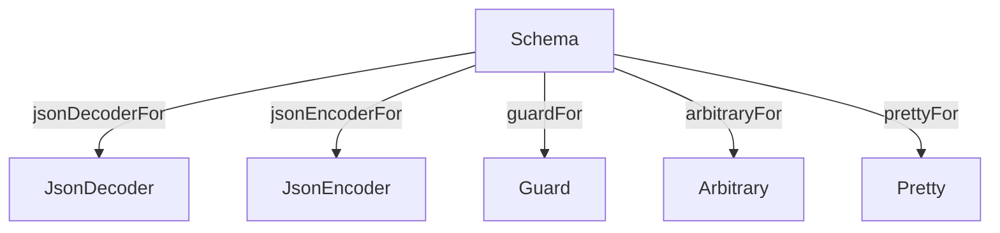

<h3 align="center">
  <a href="https://fp-ts.github.io/schema/">
    
  </a>
</h3>

<p align="center">
Schema validation with static type inference
</p>

<p align="center">
  <a href="https://www.npmjs.com/package/@fp-ts/schema">
    
  </a>
</p>



# Features

- deriving single artifacts from a `Schema`:
  - `JsonDecoder`
  - `JsonEncoder`
  - `Guard`
  - `Arbitrary`
  - `Pretty`
- `JsonCodec` (all in one artifact)
- custom interpreters
- custom schema combinators
- custom data types
- custom decode errors
- versioning (TODO)
- migration (TODO)

# Summary

```ts
import * as JC from "@fp-ts/schema/JsonCodec";
import * as fc from "fast-check";

const Person = JC.struct({
  name: S.string,
  age: S.number,
});

// extract the inferred type
type Person = S.Infer<typeof Person>;
/*
type Person = {
  readonly name: string;
  readonly age: number;
}
*/

// decode from JSON
expect(Person.decode({ name: "name", age: 18 })).toEqual(
  D.success({ name: "name", age: 18 })
);
expect(Person.decode(null)).toEqual(D.failure(DE.notType("JsonObject", null)));

// encode to JSON
expect(Person.encode({ name: "name", age: 18 })).toEqual({
  name: "name",
  age: 18,
});

// guard
expect(Person.is({ name: "name", age: 18 })).toEqual(true);
expect(Person.is(null)).toEqual(false);

// pretty print
expect(Person.pretty({ name: "name", age: 18 })).toEqual(
  '{ "name": "name", "age": 18 }'
);

// fast-check arbitrary
console.log(fc.sample(Person.arbitrary(fc), 2));
/*
[
  { name: '!U?z/X', age: -2.5223372357846707e-44 },
  { name: 'valukeypro', age: -1.401298464324817e-45 }
]
*/
```

# Custom interpreters

`src/Decoder.ts`, `src/Guard.ts` and `src/Arbitrary.ts` are good examples of defining a custom interpreter.

# Custom schema combinators

Examples in `/src/Schema.ts`.

All the combinators defined in `/src/Schema.ts` could be implemented in userland.

# Custom data types

Examples in `/src/data/*`

# Understanding Schemas

A schema is a description of a data structure that can be used to generate various artifacts from a single declaration.

## JsonDecoder

A `JsonDecoder` is a derivable artifact that is able to decode a value of type `Json` to a value of type `A`.

```ts
interface JsonDecoder<in out A> extends Schema<A> {
  readonly decode: (json: Json) => These<NonEmptyReadonlyArray<DecodeError>, A>;
}
```

## JsonEncoder

A `JsonEncoder` is a derivable artifact that is able to encode a value of type `A` to a value of type `Json`.

```ts
export interface JsonEncoder<A> extends Schema<A> {
  readonly encode: (value: A) => Json;
}
```

## Guard

A `Guard` is a derivable artifact that is able to refine a value of type `unknown` to a value of type `A`.

```ts
export interface Guard<A> extends Schema<A> {
  readonly is: (input: unknown) => input is A;
}
```

# Basic usage

## Primitives

```ts
import * as JC from "@fp-ts/schema/JsonCodec";

// $ExpectType JsonCodec<string>
JC.string;

// $ExpectType JsonCodec<string>
pipe(JC.string, JC.minLength(1));

// $ExpectType JsonCodec<string>
pipe(JC.string, JC.maxLength(10));

// $ExpectType JsonCodec<number>
JC.number;

// $ExpectType JsonCodec<number>
pipe(JC.number, JC.min(0));

// $ExpectType JsonCodec<number>
pipe(JC.number, JC.max(10));

// $ExpectType JsonCodec<boolean>
JC.boolean;
```

## Literals

```ts
// $ExpectType JsonCodec<"a">
JC.literal("a");

// $ExpectType JsonCodec<"a" | "b" | "c">
JC.literal("a", "b", "c");
```

## Native enums

```ts
enum Fruits {
  Apple,
  Banana,
}

// $ExpectType JsonCodec<typeof Fruits>
JC.nativeEnum(Fruits);
```

## Unions

```ts
// $ExpectType JsonCodec<string | number>
JC.union(JC.string, JC.number);
```

## Tuples

```ts
// $ExpectType JsonCodec<readonly [string, number]>
JC.tuple(JC.string, JC.number);
```

## Rest element

```ts
// $ExpectType Schema<readonly [string, number, ...boolean[]]>
pipe(JC.tuple(JC.string, JC.number), JC.withRest(JC.boolean));
```

## Arrays

```ts
// $ExpectType JsonCodec<readonly number[]>
JC.array(JC.number);
```

## Non empty arrays

```ts
// $ExpectType JsonCodec<readonly [number, ...number[]]>
JC.nonEmptyArray(JC.number);
```

## Structs

```ts
// $ExpectType JsonCodec<{ readonly a: string; readonly b: number; }>
JC.struct({ a: JC.string, b: JC.number });
```

## Pick

```ts
// $ExpectType JsonCodec<{ readonly a: string; }>
pipe(JC.struct({ a: JC.string, b: JC.number }), JC.pick("a"));
```

## Omit

```ts
// $ExpectType JsonCodec<{ readonly b: number; }>
pipe(JC.struct({ a: JC.string, b: JC.number }), JC.omit("a"));
```

## Partial

```ts
// $ExpectType JsonCodec<Partial<{ readonly a: string; readonly b: number; }>>
JC.partial(JC.struct({ a: JC.string, b: JC.number }));
```

## String index signature

```ts
// $ExpectType JsonCodec<{ readonly [_: string]: string; }>
JC.stringIndexSignature(JC.string);
```

## Symbol index signature

```ts
// $ExpectType JsonCodec<{ readonly [_: symbol]: string; }>
JC.symbolIndexSignature(JC.string);
```

## Extend

```ts
// $ExpectType JsonCodec<{ readonly a: string; readonly b: string; } & { readonly [_: string]: string; }>
pipe(
  JC.struct({ a: JC.string, b: JC.string }),
  JC.extend(JC.stringIndexSignature(JC.string))
);
```

## Option

```ts
// $ExpectType JsonCodec<Option<number>>
JC.option(JC.number);
```

# Documentation

- [API Reference](https://fp-ts.github.io/schema/)

# License

The MIT License (MIT)
