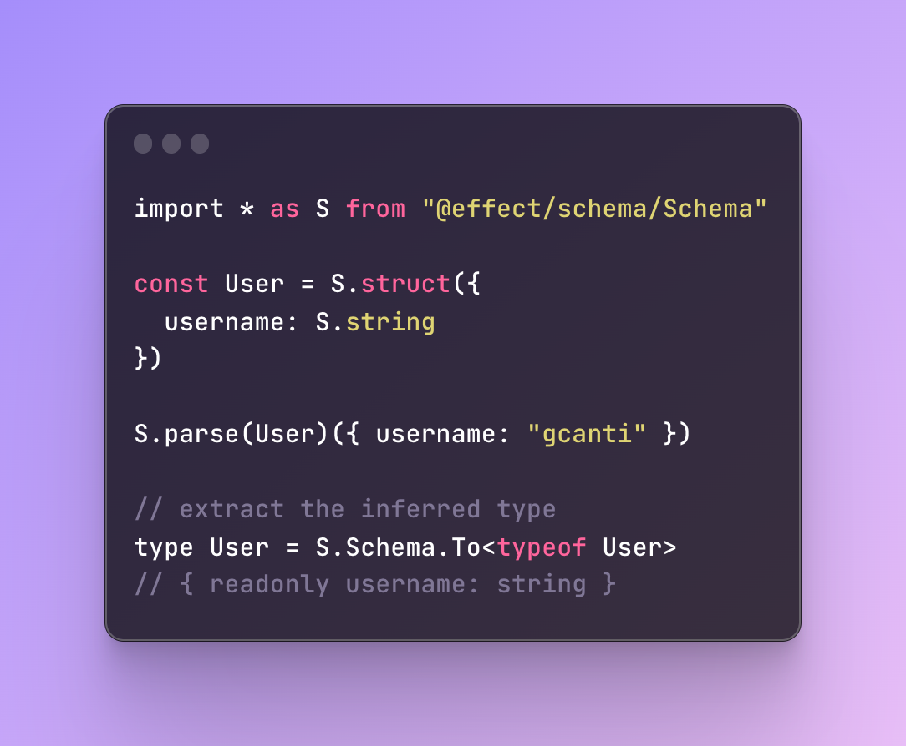

<h3 align="center">
  <a href="https://effect-ts.github.io/schema/">
    
  </a>
</h3>

<p align="center">
Modeling the schema of data structures as first-class values
</p>

<p align="center">
  <a href="https://www.npmjs.com/package/@effect/schema">
    
  </a>
</p>

# Introduction

Welcome to the documentation for `@effect/schema`, **a library for defining and using schemas** to validate and transform data in TypeScript.

`@effect/schema` allows you to define a `Schema<I, A>` that describes the structure and data types of a piece of data, and then use that `Schema` to perform various operations such as:

- parsing from `unknown`
- decoding from `I` to `A`
- encoding from `A` to `I`
- verifying that a value conforms to a given `Schema`
- generating fast-check arbitraries
- pretty printing

If you're eager to learn how to define your first schema, jump straight to the [**Basic usage**](https://github.com/effect-ts/schema#basic-usage) section!

# Credits

This library was inspired by the following projects:

- [io-ts](https://github.com/gcanti/io-ts)
- [zod](https://github.com/colinhacks/zod)
- [zio-schema](https://github.com/zio/zio-schema)

## Requirements

- TypeScript 5.0 or newer
- The `strict` flag enabled in your `tsconfig.json` file
- The `exactOptionalPropertyTypes` flag enabled in your `tsconfig.json` file

```
{
  // ...
  "compilerOptions": {
    // ...
    "strict": true,
    "exactOptionalPropertyTypes": true
  }
}
```

## Getting started

To install the **alpha** version:

```
npm install @effect/schema
```

**Warning**. This package is primarily published to receive early feedback and for contributors, during this development phase we cannot guarantee the stability of the APIs, consider each release to contain breaking changes.

Once you have installed the library, you can import the necessary types and functions from the `@effect/schema/Schema` module.

```ts
import * as S from "@effect/schema/Schema";
```

## Defining a schema

To define a `Schema`, you can use the provided `struct` function to define a new `Schema` that describes an object with a fixed set of properties. Each property of the object is described by a `Schema`, which specifies the data type and validation rules for that property.

For example, consider the following `Schema` that describes a person object with a `name` property of type `string` and an `age` property of type `number`:

```ts
import * as S from "@effect/schema/Schema";

const Person = S.struct({
  name: S.string,
  age: S.number
});
```

You can also use the `union` function to define a `Schema` that describes a value that can be one of a fixed set of types. For example, the following `Schema` describes a value that can be either a `string` or a `number`:

```ts
const StringOrNumber = S.union(S.string, S.number);
```

In addition to the provided `struct` and `union` functions, `@effect/schema/Schema` also provides a number of other functions for defining `Schema`s, including functions for defining arrays, tuples, and records.

## Extracting the inferred type

Once you have defined a `Schema`, you can use the `To` type to extract the inferred type of the data described by the `Schema`.

For example, given the `Person` `Schema` defined above, you can extract the inferred type of a `Person` object as follows:

```ts
interface Person extends S.To<typeof Person> {}
/*
interface Person {
  readonly name: string;
  readonly age: number;
}
*/
```

## Parsing

To use the `Schema` defined above to parse a value from `unknown`, you can use the `parse` function from the `@effect/schema/Schema` module:

```ts
import * as S from "@effect/schema/Schema";
import * as E from "@effect/data/Either";

const Person = S.struct({
  name: S.string,
  age: S.number
});

const parsePerson = S.parseEither(Person);

const input: unknown = { name: "Alice", age: 30 };

const result1 = parsePerson(input);
if (E.isRight(result1)) {
  console.log(result1.right); // { name: "Alice", age: 30 }
}

const result2 = parsePerson(null);
if (E.isLeft(result2)) {
  console.log(result2.left);
  /*
  {
  _tag: 'ParseError',
    errors: [
      {
        _tag: 'Type',
        expected: [Object],
        actual: null,
        message: [Object]
      }
    ]
  }
  */
}
```

The `parsePerson` function returns a value of type `ParseResult<A>`, which is a type alias for `Either<NonEmptyReadonlyArray<ParseErrors>, A>`, where `NonEmptyReadonlyArray<ParseErrors>` represents a list of errors that occurred during the parsing process and `A` is the inferred type of the data described by the `Schema`. A successful parse will result in a `Right`, containing the parsed data. A `Right` value indicates that the parse was successful and no errors occurred. In the case of a failed parse, the result will be a `Left` value containing a list of `ParseError`s.

The `parseSync` function is used to parse a value and throw an error if the parsing fails.
It is useful when you want to ensure that the value being parsed is in the correct format, and want to throw an error if it is not.

```ts
try {
  const person = S.parseSync(Person)({});
  console.log(person);
} catch (e) {
  console.error("Parsing failed:");
  console.error(e);
}
/*
Parsing failed:
Error: error(s) found
└─ ["name"]
   └─ is missing
*/
```

### Excess properties

When using a `Schema` to parse a value, any properties that are not specified in the `Schema` will be stripped out from the output. This is because the `Schema` is expecting a specific shape for the parsed value, and any excess properties do not conform to that shape.

However, you can use the `onExcessProperty` option (default value: `"ignore"`) to trigger a parsing error. This can be particularly useful in cases where you need to detect and handle potential errors or unexpected values.

Here's an example of how you might use `onExcessProperty`:

```ts
import * as S from "@effect/schema/Schema";

const Person = S.struct({
  name: S.string,
  age: S.number
});

console.log(
  S.parseSync(Person)({
    name: "Bob",
    age: 40,
    email: "bob@example.com"
  })
);
/*
{ name: 'Bob', age: 40 }
*/

S.parseSync(Person)(
  {
    name: "Bob",
    age: 40,
    email: "bob@example.com"
  },
  { onExcessProperty: "error" }
);
/*
throws
Error: error(s) found
└─ ["email"]
   └─ is unexpected
*/
```

### All errors

The `errors` option allows you to receive all parsing errors when attempting to parse a value using a schema. By default only the first error is returned, but by setting the `errors` option to `"all"`, you can receive all errors that occurred during the parsing process. This can be useful for debugging or for providing more comprehensive error messages to the user.

Here's an example of how you might use `errors`:

```ts
import * as S from "@effect/schema/Schema";

const Person = S.struct({
  name: S.string,
  age: S.number
});

S.parseSync(Person)(
  {
    name: "Bob",
    age: "abc",
    email: "bob@example.com"
  },
  { errors: "all", onExcessProperty: "error" }
);
/*
throws
Error: error(s) found
├─ ["email"]
│  └─ is unexpected
└─ ["age"]
   └─ Expected number, actual "abc"
*/
```

## Encoding

To use the `Schema` defined above to encode a value to `unknown`, you can use the `encode` function:

```ts
import * as S from "@effect/schema/Schema";
import * as E from "@effect/data/Either";

// Age is a schema that can parse a string to a number and encode a number to a string
const Age = S.numberFromString(S.string);

const Person = S.struct({
  name: S.string,
  age: Age
});

const encoded = S.encodeEither(Person)({ name: "Alice", age: 30 });
if (E.isRight(encoded)) {
  console.log(encoded.right); // { name: "Alice", age: "30" }
}
```

Note that during encoding, the number value `30` was converted to a string `"30"`.

## Formatting errors

To format errors when a parsing or an encoding function fails, you can use the `formatErrors` function from the `@effect/schema/TreeFormatter` module.

```ts
import * as S from "@effect/schema/Schema";
import { formatErrors } from "@effect/schema/TreeFormatter";
import * as E from "@effect/data/Either";

const Person = S.struct({
  name: S.string,
  age: S.number
});

const result = S.parseEither(Person)({});
if (E.isLeft(result)) {
  console.error("Parsing failed:");
  console.error(formatErrors(result.left.errors));
}
/*
Parsing failed:
error(s) found
└─ ["name"]
   └─ is missing
*/
```

## Assertions

The `is` function provided by the `@effect/schema/Schema` module represents a way of verifying that a value conforms to a given `Schema`. `is` is a refinement that takes a value of type `unknown` as an argument and returns a `boolean` indicating whether or not the value conforms to the `Schema`.

```ts
import * as S from "@effect/schema/Schema";

const Person = S.struct({
  name: S.string,
  age: S.number
});

// const isPerson: (u: unknown) => u is Person
const isPerson = S.is(Person);

console.log(isPerson({ name: "Alice", age: 30 })); // true
console.log(isPerson(null)); // false
console.log(isPerson({})); // false
```

The `asserts` function takes a `Schema` and returns a function that takes an input value and checks if it matches the schema. If it does not match the schema, it throws an error with a comprehensive error message.

```ts
import * as S from "@effect/schema/Schema";

const Person = S.struct({
  name: S.string,
  age: S.number
});

// const assertsPerson: (input: unknown) => asserts input is Person
const assertsPerson: S.ToAsserts<typeof Person> = S.asserts(Person);

try {
  assertsPerson({ name: "Alice", age: "30" });
} catch (e) {
  console.error("The input does not match the schema:");
  console.error(e);
}
/*
The input does not match the schema:
Error: error(s) found
└─ ["age"]
   └─ Expected number, actual "30"
*/

// this will not throw an error
assertsPerson({ name: "Alice", age: 30 });
```

## [fast-check](https://github.com/dubzzz/fast-check) arbitraries

The `arbitrary` function provided by the `@effect/schema/Arbitrary` module represents a way of generating random values that conform to a given `Schema`. This can be useful for testing purposes, as it allows you to generate random test data that is guaranteed to be valid according to the `Schema`.

```ts
import { pipe } from "@effect/data/Function";
import * as S from "@effect/schema/Schema";
import * as A from "@effect/schema/Arbitrary";
import * as fc from "fast-check";

const Person = S.struct({
  name: S.string,
  age: S.string.pipe(S.numberFromString, S.int())
});

// Arbitrary for the To type
const PersonArbitraryTo = A.to(Person)(fc);

console.log(fc.sample(PersonArbitraryTo, 2));
/*
[
  { name: 'WJh;`Jz', age: 3.4028216409684243e+38 },
  { name: 'x&~', age: 139480325657985020 }
]
*/

// Arbitrary for the From type
const PersonArbitraryFrom = A.from(Person)(fc);

console.log(fc.sample(PersonArbitraryFrom, 2));
/*
[ { name: 'Q}"H@aT', age: ']P$8w' }, { name: '|', age: '"' } ]
*/
```

## Pretty print

The `pretty` function provided by the `@effect/schema/Pretty` module represents a way of pretty-printing values that conform to a given `Schema`.

You can use the `pretty` function to create a human-readable string representation of a value that conforms to a `Schema`. This can be useful for debugging or logging purposes, as it allows you to easily inspect the structure and data types of the value.

```ts
import * as S from "@effect/schema/Schema";
import * as P from "@effect/schema/Pretty";

const Person = S.struct({
  name: S.string,
  age: S.number
});

const PersonPretty = P.to(Person);

// returns a string representation of the object
console.log(PersonPretty({ name: "Alice", age: 30 })); // `{ "name": "Alice", "age": 30 }`
```

# Basic usage

## Primitives

```ts
import * as S from "@effect/schema/Schema";

// primitive values
S.string;
S.number;
S.bigint;
S.boolean;
S.symbol;
S.object;

// empty types
S.undefined;
S.void; // accepts undefined

// catch-all types
// allows any value
S.any;
S.unknown;

// never type
// allows no values
S.never;

S.json;
S.UUID;
S.ULID;
```

## Literals

```ts
S.null; // same as S.literal(null)
S.literal("a");
S.literal("a", "b", "c"); // union of literals
S.literal(1);
S.literal(2n); // bigint literal
S.literal(true);
```

## Template literals

The `templateLiteral` combinator allows you to create a schema for a TypeScript template literal type.

```ts
// $ExpectType Schema<`a${string}`>
S.templateLiteral(S.literal("a"), S.string);

// example from https://www.typescriptlang.org/docs/handbook/2/template-literal-types.html
const EmailLocaleIDs = S.literal("welcome_email", "email_heading");
const FooterLocaleIDs = S.literal("footer_title", "footer_sendoff");

// $ExpectType Schema<"welcome_email_id" | "email_heading_id" | "footer_title_id" | "footer_sendoff_id">
S.templateLiteral(S.union(EmailLocaleIDs, FooterLocaleIDs), S.literal("_id"));
```

## Filters

**Note**. Please note that the use of filters do not alter the type of the `Schema`. They only serve to add additional constraints to the parsing process.

### String filters

```ts
S.string.pipe(S.maxLength(5));
S.string.pipe(S.minLength(5));
S.string.pipe(nonEmpty()); // same as S.minLength(1)
S.string.pipe(S.length(5));
S.string.pipe(S.pattern(regex));
S.string.pipe(S.startsWith(string));
S.string.pipe(S.endsWith(string));
S.string.pipe(S.includes(searchString));
S.string.pipe(S.trimmed()); // verifies that a string contains no leading or trailing whitespaces
```

**Note**: The `trimmed` combinator does not make any transformations, it only validates. If what you were looking for was a combinator to trim strings, then check out the `trim` combinator ot the `Trim` schema.

### Number filters

```ts
S.number.pipe(S.greaterThan(5));
S.number.pipe(S.greaterThanOrEqualTo(5));
S.number.pipe(S.lessThan(5));
S.number.pipe(S.lessThanOrEqualTo(5));
S.number.pipe(S.between(-2, 2)); // -2 <= x <= 2

S.number.pipe(S.int()); // value must be an integer

S.number.pipe(S.nonNaN()); // not NaN
S.number.pipe(S.finite()); // ensures that the value being parsed is finite and not equal to Infinity or -Infinity

S.number.pipe(S.positive()); // > 0
S.number.pipe(S.nonNegative()); // >= 0
S.number.pipe(S.negative()); // < 0
S.number.pipe(S.nonPositive()); // <= 0

S.number.pipe(S.multipleOf(5)); // evenly divisible by 5
```

### Bigint filters

```ts
import * as S from "@effect/schema/Schema";

S.bigint.pipe(S.greaterThanBigint(5n));
S.bigint.pipe(S.greaterThanOrEqualToBigint(5n));
S.bigint.pipe(S.lessThanBigint(5n));
S.bigint.pipe(S.lessThanOrEqualToBigint(5n));
S.bigint.pipe(S.betweenBigint(-2n, 2n)); // -2n <= x <= 2n

S.bigint.pipe(S.positiveBigint()); // > 0n
S.bigint.pipe(S.nonNegativeBigint()); // >= 0n
S.bigint.pipe(S.negativeBigint()); // < 0n
S.bigint.pipe(S.nonPositiveBigint()); // <= 0n
```

### Array filters

```ts
import * as S from "@effect/schema/Schema";

S.array(S.number).pipe(S.maxItems(2)); // max array length
S.array(S.number).pipe(S.minItems(2)); // min array length
S.array(S.number).pipe(S.itemsCount(2)); // exact array length
```

## Branded types

TypeScript's type system is structural, which means that any two types that are structurally equivalent are considered the same. This can cause issues when types that are semantically different are treated as if they were the same.

```ts
type UserId = string
type Username = string

const getUser = (id: UserId) => { ... }

const myUsername: Username = "gcanti"

getUser(myUsername) // works fine
```

In the above example, `UserId` and `Username` are both aliases for the same type, `string`. This means that the `getUser` function can mistakenly accept a `Username` as a valid `UserId`, causing bugs and errors.

To avoid these kinds of issues, the `@effect` ecosystem provides a way to create custom types with a unique identifier attached to them. These are known as "branded types".

```ts
import type * as B from "@effect/data/Brand"

type UserId = string & B.Brand<"UserId">
type Username = string

const getUser = (id: UserId) => { ... }

const myUsername: Username = "gcanti"

getUser(myUsername) // error
```

By defining `UserId` as a branded type, the `getUser` function can accept only values of type `UserId`, and not plain strings or other types that are compatible with strings. This helps to prevent bugs caused by accidentally passing the wrong type of value to the function.

There are two ways to define a schema for a branded type, depending on whether you:

- want to define the schema from scratch
- have already defined a branded type via `@effect/data/Brand` and want to reuse it to define a schema

### Defining a schema from scratch

To define a schema for a branded type from scratch, you can use the `brand` combinator exported by the `@effect/schema/Schema` module. Here's an example:

```ts
import { pipe } from "@effect/data/Function";
import * as S from "@effect/schema/Schema";

const UserId = S.string.pipe(S.brand("UserId"));
type UserId = S.To<typeof UserId>; // string & Brand<"UserId">
```

Note that you can use `unique symbol`s as brands to ensure uniqueness across modules / packages:

```ts
import { pipe } from "@effect/data/Function";
import * as S from "@effect/schema/Schema";

const UserIdBrand = Symbol.for("UserId");
const UserId = S.string.pipe(S.brand(UserIdBrand));
type UserId = S.To<typeof UserId>; // string & Brand<typeof UserIdBrand>
```

### Reusing an existing branded type

If you have already defined a branded type using the `@effect/data/Brand` module, you can reuse it to define a schema using the `fromBrand` combinator exported by the `@effect/schema/Schema` module. Here's an example:

```ts
import * as B from "@effect/data/Brand";

// the existing branded type
type UserId = string & B.Brand<"UserId">;
const UserId = B.nominal<UserId>();

import { pipe } from "@effect/data/Function";
import * as S from "@effect/schema/Schema";

// Define a schema for the branded type
const UserIdSchema = S.string.pipe(S.fromBrand(UserId));
```

## Native enums

```ts
enum Fruits {
  Apple,
  Banana
}

// $ExpectType Schema<Fruits>
S.enums(Fruits);
```

## Nullables

```ts
// $ExpectType Schema<string | null>
S.nullable(S.string);
```

## Unions

`@effect/schema/Schema` includes a built-in `union` combinator for composing "OR" types.

```ts
// $ExpectType Schema<string | number>
S.union(S.string, S.number);
```

### Union of literals

While the following is perfectly acceptable:

```ts
// $ExpectType Schema<"a" | "b" | "c">
const schema = S.union(S.literal("a"), S.literal("b"), S.literal("c"));
```

It is possible to use `literal` and pass multiple literals, which is less cumbersome:

```ts
// $ExpectType Schema<"a" | "b" | "c">
const schema = S.literal("a", "b", "c");
```

Under the hood, they are the same, as `literal(...literals)` will be converted into a union.

### Discriminated unions

TypeScript reference: https://www.typescriptlang.org/docs/handbook/2/narrowing.html#discriminated-unions

Discriminated unions in TypeScript are a way of modeling complex data structures that may take on different forms based on a specific set of conditions or properties. They allow you to define a type that represents multiple related shapes, where each shape is uniquely identified by a shared discriminant property.

In a discriminated union, each variant of the union has a common property, called the discriminant. The discriminant is a literal type, which means it can only have a finite set of possible values. Based on the value of the discriminant property, TypeScript can infer which variant of the union is currently in use.

Here is an example of a discriminated union in TypeScript:

```ts
type Circle = {
  readonly kind: "circle";
  readonly radius: number;
};

type Square = {
  readonly kind: "square";
  readonly sideLength: number;
};

type Shape = Circle | Square;
```

This code defines a discriminated union using the `@effect/schema` library:

```ts
import * as S from "@effect/schema/Schema";

const Circle = S.struct({
  kind: S.literal("circle"),
  radius: S.number
});

const Square = S.struct({
  kind: S.literal("square"),
  sideLength: S.number
});

const Shape = S.union(Circle, Square);
```

The `literal` combinator is used to define the discriminant property with a specific string literal value.

Two structs are defined for `Circle` and `Square`, each with their own properties. These structs represent the variants of the union.

Finally, the `union` combinator is used to create a schema for the discriminated union `Shape`, which is a union of `Circle` and `Square`.

### How to transform a simple union into a discriminated union

If you're working on a TypeScript project and you've defined a simple union to represent a particular input, you may find yourself in a situation where you're not entirely happy with how it's set up. For example, let's say you've defined a `Shape` union as a combination of `Circle` and `Square` without any special property:

```ts
import * as S from "@effect/schema/Schema";

const Circle = S.struct({
  radius: S.number
});

const Square = S.struct({
  sideLength: S.number
});

const Shape = S.union(Circle, Square);
```

To make your code more manageable, you may want to transform the simple union into a discriminated union. This way, TypeScript will be able to automatically determine which member of the union you're working with based on the value of a specific property.

To achieve this, you can add a special property to each member of the union, which will allow TypeScript to know which type it's dealing with at runtime. Here's how you can transform the `Shape` schema into another schema that represents a discriminated union:

```ts
import * as S from "@effect/schema/Schema";
import { pipe } from "@effect/data/Function";

const Circle = S.struct({
  radius: S.number
});

const Square = S.struct({
  sideLength: S.number
});

const DiscriminatedShape = S.union(
  Circle.pipe(
    S.transform(
      Circle.pipe(S.extend(S.struct({ kind: S.literal("circle") }))), // Add a "kind" property with the literal value "circle" to Circle
      (circle) => ({ ...circle, kind: "circle" as const }), // Add the discriminant property to Circle
      ({ kind: _kind, ...rest }) => rest // Remove the discriminant property
    )
  ),
  Square.pipe(
    S.transform(
      Square.pipe(S.extend(S.struct({ kind: S.literal("square") }))), // Add a "kind" property with the literal value "square" to Square
      (square) => ({ ...square, kind: "square" as const }), // Add the discriminant property to Square
      ({ kind: _kind, ...rest }) => rest // Remove the discriminant property
    )
  )
);

expect(S.parseSync(DiscriminatedShape)({ radius: 10 })).toEqual({
  kind: "circle",
  radius: 10
});

expect(S.parseSync(DiscriminatedShape)({ sideLength: 10 })).toEqual({
  kind: "square",
  sideLength: 10
});
```

In this example, we use the `extend` function to add a "kind" property with a literal value to each member of the union. Then we use `transform` to add the discriminant property and remove it afterwards. Finally, we use `union` to combine the transformed schemas into a discriminated union.

However, when we use the schema to encode a value, we want the output to match the original input shape. Therefore, we must remove the discriminant property we added earlier from the encoded value to match the original shape of the input.

The previous solution works perfectly and shows how we can add and remove properties to our schema at will, making it easier to consume the result within our domain model. However, it requires a lot of boilerplate. Fortunately, there is an API called `attachPropertySignature` designed specifically for this use case, which allows us to achieve the same result with much less effort:

```ts
const Circle = S.struct({ radius: S.number });
const Square = S.struct({ sideLength: S.number });
const DiscriminatedShape = S.union(
  Circle.pipe(S.attachPropertySignature("kind", "circle")),
  Square.pipe(S.attachPropertySignature("kind", "square"))
);

// parsing
expect(S.parseSync(DiscriminatedShape)({ radius: 10 })).toEqual({
  kind: "circle",
  radius: 10
});

// encoding
expect(
  S.encodeSync(DiscriminatedShape)({
    kind: "circle",
    radius: 10
  })
).toEqual({ radius: 10 });
```

## Tuples

```ts
// $ExpectType Schema<readonly [string, number]>
S.tuple(S.string, S.number);
```

### Append a required element

```ts
// $ExpectType Schema<readonly [string, number, boolean]>
S.tuple(S.string, S.number).pipe(S.element(S.boolean));
```

### Append an optional element

```ts
// $ExpectType Schema<readonly [string, number, boolean?]>
S.tuple(S.string, S.number).pipe(S.optionalElement(S.boolean));
```

### Append a rest element

```ts
// $ExpectType Schema<readonly [string, number, ...boolean[]]>
S.tuple(S.string, S.number).pipe(S.rest(S.boolean));
```

## Arrays

```ts
// $ExpectType Schema<readonly number[]>
S.array(S.number);
```

### Non empty arrays

```ts
// $ExpectType Schema<readonly [number, ...number[]]>
S.nonEmptyArray(S.number);
```

## Structs

```ts
// $ExpectType Schema<{ readonly a: string; readonly b: number; }>
S.struct({ a: S.string, b: S.number });
```

### Optional fields

```ts
// $ExpectType Schema<{ readonly a: string; readonly b: number; readonly c?: boolean; }>
S.struct({ a: S.string, b: S.number, c: S.optional(S.boolean) });
```

**Note**. The `optional` constructor only exists to be used in combination with the `struct` API to signal an optional field and does not have a broader meaning. This means that it is only allowed to use it as an outer wrapper of a `Schema` and **it cannot be followed by other combinators**, for example this type of operation is prohibited:

```ts
S.struct({
  // the use of S.optional should be the last step in the pipeline and not preceeded by other combinators like S.nullable
  c: S.boolean.pipe(S.optional, S.nullable) // type checker error
});
```

and it must be rewritten like this:

```ts
S.struct({
  c: S.boolean.pipe(S.nullable, S.optional) // ok
});
```

#### Default values

Optional fields can be configured to accept a default value, making the field optional in input and required in output:

```ts
// $ExpectType Schema<{ readonly a?: number; }, { readonly a: number; }>
const schema = S.struct({ a: S.optional(S.number).withDefault(() => 0) });

const parse = S.parseSync(schema);

parse({}); // { a: 0 }
parse({ a: 1 }); // { a: 1 }

const encode = S.encodeSync(schema);

encode({ a: 0 }); // { a: 0 }
encode({ a: 1 }); // { a: 1 }
```

#### Optional fields as `Option`s

Optional fields can be configured to transform a value of type `A` into `Option<A>`, making the field optional in input and required in output:

```ts
import * as O from "@effect/data/Option"

// $ExpectType Schema<{ readonly a?: number; }, { readonly a: Option<number>; }>
const schema = S.struct({ a. S.optional(S.number).toOption() });

const parse = S.parseSync(schema)

parse({}) // { a: none() }
parse({ a: 1 }) // { a: some(1) }

const encode = S.encodeSync(schema)

encode({ a: O.none() }) // {}
encode({ a: O.some(1) }) // { a: 1 }
```

## Pick

```ts
// $ExpectType Schema<{ readonly a: string; }>
S.struct({ a: S.string, b: S.number }).pipe(S.pick("a"));
```

## Omit

```ts
// $ExpectType Schema<{ readonly b: number; }>
S.struct({ a: S.string, b: S.number }).pipe(S.omit("a"));
```

## Partial

```ts
// $ExpectType Schema<Partial<{ readonly a: string; readonly b: number; }>>
S.partial(S.struct({ a: S.string, b: S.number }));
```

## Required

```ts
// $ExpectType Schema<Required<{ readonly a?: string; readonly b?: number; }>>
S.required(S.struct({ a: S.optional(S.string), b: S.optional(S.number) }));
```

## Records

### String keys

```ts
// $ExpectType Schema<{ readonly [x: string]: string; }>
S.record(S.string, S.string);

// $ExpectType Schema<{ readonly a: string; readonly b: string; }>
S.record(S.union(S.literal("a"), S.literal("b")), S.string);
```

### Keys refinements

```ts
// $ExpectType Schema<{ readonly [x: string]: string; }>
S.record(S.string.pipe(S.minLength(2)), S.string);
```

### Symbol keys

```ts
// $ExpectType Schema<{ readonly [x: symbol]: string; }>
S.record(S.symbol, S.string);
```

### Template literal keys

```ts
// $ExpectType Schema<{ readonly [x: `a${string}`]: string; }>
S.record(S.templateLiteral(S.literal("a"), S.string), S.string);
```

## Extend

The `extend` combinator allows you to add additional fields or index signatures to an existing `Schema`.

```ts
// $ExpectType Schema<{ [x: string]: string; readonly a: string; readonly b: string; readonly c: string; }>
S.struct({ a: S.string, b: S.string }).pipe(
  S.extend(S.struct({ c: S.string })), // <= you can add more fields
  S.extend(S.record(S.string, S.string)) // <= you can add index signatures
);
```

## Compose

The `compose` combinator allows you to combine two schemas.

```ts
// $ExpectType Schema<string, readonly number[]>
S.compose(S.split(S.string, ","), S.array(S.NumberFromString));
```

## InstanceOf

In the following section, we demonstrate how to use the `instanceOf` combinator to create a `Schema` for a class instance.

```ts
class Test {
  constructor(readonly name: string) {}
}

// $ExpectType Schema<Test>
S.instanceOf(Test);
```

## Recursive types

The `lazy` combinator is useful when you need to define a `Schema` that depends on itself, like in the case of recursive data structures. In this example, the `Category` schema depends on itself because it has a field `subcategories` that is an array of `Category` objects.

```ts
interface Category {
  readonly name: string;
  readonly subcategories: ReadonlyArray<Category>;
}

const Category: S.Schema<Category> = S.lazy(() =>
  S.struct({
    name: S.string,
    subcategories: S.array(Category)
  })
);
```

Here's an example of two mutually recursive schemas, `Expression` and `Operation`, that represent a simple arithmetic expression tree.

```ts
interface Expression {
  readonly type: "expression";
  readonly value: number | Operation;
}

interface Operation {
  readonly type: "operation";
  readonly operator: "+" | "-";
  readonly left: Expression;
  readonly right: Expression;
}

const Expression: S.Schema<Expression> = S.lazy(() =>
  S.struct({
    type: S.literal("expression"),
    value: S.union(S.number, Operation)
  })
);

const Operation: S.Schema<Operation> = S.lazy(() =>
  S.struct({
    type: S.literal("operation"),
    operator: S.union(S.literal("+"), S.literal("-")),
    left: Expression,
    right: Expression
  })
);
```

## Transformations

In some cases, we may need to transform the output of a schema to a different type. For instance, we may want to parse a string into a number, or we may want to transform a date string into a `Date` object.

To perform these kinds of transformations, the `@effect/schema` library provides the `transform` combinator.

### transform

```ts
<I1, A1, I2, A2>(from: Schema<I1, A1>, to: Schema<I2, A2>, decode: (a1: A1) => I2, encode: (i2: I2) => A1): Schema<I1, A2>
```


The `transform` combinator takes a target schema, a transformation function from the source type to the target type, and a reverse transformation function from the target type back to the source type. It returns a new schema that applies the transformation function to the output of the original schema before returning it. If the original schema fails to parse a value, the transformed schema will also fail.

```ts
import * as S from "@effect/schema/Schema";

// use the transform combinator to convert the string schema into the tuple schema
export const transformedSchema: S.Schema<string, readonly [string]> =
  S.transform(
    S.string,
    S.tuple(S.string),
    // define a function that converts a string into a tuple with one element of type string
    (s) => [s] as const,
    // define a function that converts a tuple with one element of type string into a string
    ([s]) => s
  );
```

In the example above, we defined a schema for the `string` type and a schema for the tuple type `[string]`. We also defined the functions `decode` and `encode` that convert a `string` into a tuple and a tuple into a `string`, respectively. Then, we used the `transform` combinator to convert the string schema into a schema for the tuple type `[string]`. The resulting schema can be used to parse values of type `string` into values of type `[string]`.

### transformResult

The `transformResult` combinator works in a similar way, but allows the transformation function to return a `ParseResult` object, which can either be a success or a failure.

```ts
import * as PR from "@effect/schema/ParseResult";
import * as S from "@effect/schema/Schema";

export const transformedSchema: S.Schema<string, boolean> = S.transformResult(
  S.string,
  S.boolean,
  // define a function that converts a string into a boolean
  (s) =>
    s === "true"
      ? PR.success(true)
      : s === "false"
      ? PR.success(false)
      : PR.failure(PR.type(S.literal("true", "false").ast, s)),
  // define a function that converts a boolean into a string
  (b) => PR.success(String(b))
);
```

The transformation may also be async:

```ts
import * as S from "@effect/schema/Schema";
import * as PR from "@effect/schema/ParseResult";
import * as Effect from "@effect/io/Effect";
import fetch from "node-fetch";
import { pipe } from "@effect/data/Function";
import * as TF from "@effect/schema/TreeFormatter";

const api = (url: string) =>
  Effect.tryPromise({
    try: () =>
      fetch(url).then((res) => {
        if (res.ok) {
          return res.json() as Promise<unknown>;
        }
        throw new Error(String(res.status));
      }),
    catch: (e) => new Error(String(e))
  });

const PeopleId = S.string.pipe(S.brand("PeopleId"));

const PeopleIdFromString = S.transformResult(
  S.string,
  PeopleId,
  (s) =>
    Effect.mapBoth(
      api(`https://swapi.dev/api/people/${s}`),
      (e) => PR.parseError([PR.type(PeopleId.ast, s, e.message)]),
      () => s
    ),
  PR.success
);

const parse = (id: string) =>
  Effect.mapError(S.parse(PeopleIdFromString)(id), (e) =>
    TF.formatErrors(e.errors)
  );

Effect.runPromiseExit(parse("1")).then(console.log);
// Exit.Success(1)

Effect.runPromiseExit(parse("fail")).then(console.log);
// Exit.Failure('error(s) found\n└─ Error: 404')
```

### String transformations

#### split

The `split` combinator allows splitting a string into an array of strings.

```ts
import * as S from "@effect/schema/Schema";

// const schema: S.Schema<string, string>
const schema = S.string.pipe(S.split(","));
const parse = S.parseSync(schema);

parse(""); // [""]
parse(","); // ["", ""]
parse("a,"); // ["a", ""]
parse("a,b"); // ["a", "b"]
```

#### Trim

The `Trim` schema allows removing whitespaces from the beginning and end of a string.

```ts
import * as S from "@effect/schema/Schema";

// const schema: S.Schema<string, string>
const schema = S.Trim;
const parse = S.parseSync(schema);

parse("a"); // "a"
parse(" a"); // "a"
parse("a "); // "a"
parse(" a "); // "a"
```

**Note**. If you were looking for a combinator to check if a string is trimmed, check out the `trimmed` combinator.

### Number transformations

#### NumberFromString

Transforms a `string` into a `number` by parsing the string using `parseFloat`.

The following special string values are supported: "NaN", "Infinity", "-Infinity".

```ts
import * as S from "@effect/schema/Schema";

// const schema: S.Schema<string, number>
const schema = S.NumberFromString;
const parse = S.parseSync(schema);

// success cases
parse("1"); // 1
parse("-1"); // -1
parse("1.5"); // 1.5
parse("NaN"); // NaN
parse("Infinity"); // Infinity
parse("-Infinity"); // -Infinity

// failure cases
parse("a"); // throws
```

#### clamp

Clamps a `number` between a minimum and a maximum value.

```ts
import * as S from "@effect/schema/Schema";

// const schema: S.Schema<number, number>
const schema = S.number.pipe(S.clamp(-1, 1)); // clamps the input to -1 <= x <= 1

const parse = S.parseSync(schema);
parse(-3); // -1
parse(0); // 0
parse(3); // 1
```

### Bigint transformations

#### BigintFromString

Transforms a `string` into a `bigint` by parsing the string using `BigInt`.

```ts
import * as S from "@effect/schema/Schema";

// const schema: S.Schema<string, bigint>
const schema = S.BigintFromString;
const parse = S.parseSync(schema);

// success cases
parse("1"); // 1n
parse("-1"); // -1n

// failure cases
parse("a"); // throws
parse("1.5"); // throws
parse("NaN"); // throws
parse("Infinity"); // throws
parse("-Infinity"); // throws
```

#### clamp

Clamps a `bigint` between a minimum and a maximum value.

```ts
import * as S from "@effect/schema/Schema";

// const schema: S.Schema<bigint, bigint>
const schema = S.bigint.pipe(S.clampBigint(-1n, 1n)); // clamps the input to -1n <= x <= 1n

const parse = S.parseSync(schema);
parse(-3n); // -1n
parse(0n); // 0n
parse(3n); // 1n
```

### Boolean transformations

#### not

Negates a boolean value.

```ts
import * as S from "@effect/schema/Schema";

// const schema: S.Schema<boolean, boolean>
const schema = S.boolean.pipe(S.not);

const parse = S.parseSync(schema);
parse(true); // false
parse(false); // true
```

### Date transformations

#### Date

Transforms a `string` into a valid `Date`.

```ts
import * as S from "@effect/schema/Schema";

// const schema: S.Schema<string, Date>
const schema = S.Date;
const parse = S.parseSync(schema);

parse("1970-01-01T00:00:00.000Z"); // new Date(0)

parse("a"); // throws

const validate = S.validateSync(schema);

validate(new Date(0)); // new Date(0)
validate(new Date("fail")); // throws
```

## Interop with `@effect/data/Data`

The `@effect/data/Data` module in the Effect ecosystem serves as a utility module that simplifies the process of comparing values for equality without the need for explicit implementations of the `Equal` and `Hash` interfaces. It provides convenient APIs that automatically generate default implementations for equality checks, making it easier for developers to perform equality comparisons in their applications.

```ts
import * as Data from "@effect/data/Data";
import * as Equal from "@effect/data/Equal";

const person1 = Data.struct({ name: "Alice", age: 30 });
const person2 = Data.struct({ name: "Alice", age: 30 });

console.log(Equal.equals(person1, person2)); // true
```

You can use the `Schema.data(schema)` combinator to build a schema from an existing schema that can decode a value `A` to a value `Data<A>`:

```ts
/*
S.Schema<{
    readonly name: string;
    readonly age: number;
}, Data.Data<{
    readonly name: string;
    readonly age: number;
}>>
*/
const schema = S.data(
  S.struct({
    name: S.string,
    age: S.number
  })
);

const decode = S.decode(schema);

const person1 = decode({ name: "Alice", age: 30 });
const person2 = decode({ name: "Alice", age: 30 });

console.log(Equal.equals(person1, person2)); // true
```

## Option

### Parsing from nullable fields

The `option` combinator in `@effect/schema/Schema` allows you to specify that a field in a schema is of type `Option<A>` and can be parsed from a required nullable field `A | undefined | null`. This is particularly useful when working with JSON data that may contain `null` values for optional fields.

When parsing a nullable field, the `option` combinator follows these conversion rules:

- `undefined` and `null` parse to `None`
- `A` parses to `Some<A>`

Here's an example that demonstrates how to use the `option` combinator:

```ts
import * as S from "@effect/schema/Schema";
import * as O from "@effect/data/Option";

/*
const schema: S.Schema<{
    readonly a: string;
    readonly b: number | null;
}, {
    readonly a: string;
    readonly b: O.Option<number>;
}>
*/
const schema = S.struct({
  a: S.string,
  b: S.optionFromNullable(S.number)
});

// parsing
const parse = S.parseSync(schema);
parse({ a: "hello", b: null }); // { a: "hello", b: none() }
parse({ a: "hello", b: 1 }); // { a: "hello", b: some(1) }

parse({ a: "hello", b: undefined }); // throws
parse({ a: "hello" }); // throws (key "b" is missing)

// encoding
const encodeOrThrow = S.encodeSync(schema);

encodeOrThrow({ a: "hello", b: O.none() }); // { a: 'hello', b: null }
encodeOrThrow({ a: "hello", b: O.some(1) }); // { a: 'hello', b: 1 }
```

## ReadonlySet

In the following section, we demonstrate how to use the `readonlySet` combinator to parse a `ReadonlySet` from an array of values.

```ts
import * as S from "@effect/schema/Schema";

// const schema: S.Schema<readonly number[], ReadonlySet<number>>
const schema = S.readonlySet(S.number); // define a schema for ReadonlySet with number values
const parse = S.parseSync(schema);

parse([1, 2, 3]); // new Set([1, 2, 3])
```

## ReadonlyMap

In the following section, we demonstrate how to use the `readonlyMap` combinator to parse a `ReadonlyMap` from an array of entries.

```ts
import * as S from "@effect/schema/Schema";

// const schema: S.Schema<readonly (readonly [number, string])[], ReadonlyMap<number, string>>
const schema = S.readonlyMap(S.number, S.string); // define the schema for ReadonlyMap with number keys and string values
const parse = S.parseSync(schema);

parse([
  [1, "a"],
  [2, "b"],
  [3, "c"]
]); // new Map([[1, "a"], [2, "b"], [3, "c"]])
```

# Adding new data types

The easiest way to define a new data type is through the `filter` combinator.

```ts
import * as S from "@effect/schema/Schema";

const LongString = S.string.pipe(
  S.filter((s) => s.length >= 10, {
    message: () => "a string at least 10 characters long"
  })
);

console.log(S.parseSync(LongString)("a"));
/*
error(s) found
└─ Expected a string at least 10 characters long, actual "a"
*/
```

It is good practice to add as much metadata as possible so that it can be used later by introspecting the schema.

```ts
const LongString = S.string.pipe(
  S.filter((s) => s.length >= 10, {
    message: () => "a string at least 10 characters long",
    identifier: "LongString",
    jsonSchema: { minLength: 10 },
    description:
      "Lorem ipsum dolor sit amet, consectetur adipiscing elit, sed do eiusmod tempor incididunt ut labore et dolore magna aliqua"
  })
);
```

# Technical overview

## Understanding Schemas

A schema is a description of a data structure that can be used to generate various artifacts from a single declaration.

From a technical point of view a schema is just a typed wrapper of an `AST` value:

```ts
interface Schema<I, A> {
  readonly ast: AST;
}
```

The `AST` type represents a tiny portion of the TypeScript AST, roughly speaking the part describing ADTs (algebraic data types),
i.e. products (like structs and tuples) and unions, plus a custom transformation node.

This means that you can define your own schema constructors / combinators as long as you are able to manipulate the `AST` value accordingly, let's see an example.

Say we want to define a `pair` schema constructor, which takes a `Schema<A>` as input and returns a `Schema<readonly [A, A]>` as output.

First of all we need to define the signature of `pair`

```ts
import * as S from "@effect/schema/Schema";

declare const pair: <A>(schema: S.Schema<A>) => S.Schema<readonly [A, A]>;
```

Then we can implement the body using the APIs exported by the `@effect/schema/AST` module:

```ts
import * as S from "@effect/schema/Schema";
import * as AST from "@effect/schema/AST";
import * as O from "@effect/data/Option";

const pair = <A>(schema: S.Schema<A>): S.Schema<readonly [A, A]> => {
  const element = AST.createElement(
    schema.ast, // <= the element type
    false // <= is optional?
  );
  const tuple = AST.createTuple(
    [element, element], // <= elements definitions
    O.none, // <= rest element
    true // <= is readonly?
  );
  return S.make(tuple); // <= wrap the AST value in a Schema
};
```

This example demonstrates the use of the low-level APIs of the `AST` module, however, the same result can be achieved more easily and conveniently by using the high-level APIs provided by the `Schema` module.

```ts
const pair = <A>(schema: S.Schema<A>): S.Schema<readonly [A, A]> =>
  S.tuple(schema, schema);
```

## Annotations

One of the fundamental requirements in the design of `@effect/schema` is that it is extensible and customizable. Customizations are achieved through "annotations". Each node contained in the AST of `@effect/schema/AST` contains an `annotations: Record<string | symbol, unknown>` field that can be used to attach additional information to the schema.

Let's see some examples:

```ts
import { pipe } from "@effect/data/Function";
import * as S from "@effect/schema/Schema";

const Password =
  // initial schema, a string
  S.string.pipe(
    // add an error message for non-string values (annotation)
    S.message(() => "not a string"),
    // add a constraint to the schema, only non-empty strings are valid
    // and add an error message for empty strings (annotation)
    S.nonEmpty({ message: () => "required" }),
    // add a constraint to the schema, only strings with a length less or equal than 10 are valid
    // and add an error message for strings that are too long (annotation)
    S.maxLength(10, { message: (s) => `${s} is too long` }),
    // add an identifier to the schema (annotation)
    S.identifier("Password"),
    // add a title to the schema (annotation)
    S.title("password"),
    // add a description to the schema (annotation)
    S.description(
      "A password is a string of characters used to verify the identity of a user during the authentication process"
    ),
    // add examples to the schema (annotation)
    S.examples(["1Ki77y", "jelly22fi$h"]),
    // add documentation to the schema (annotation)
    S.documentation(`
    jsDoc documentation...
  `)
  );
```

The example shows some built-in combinators to add meta information, but users can easily add their own meta information by defining a custom combinator.

Here's an example of how to add a `deprecated` annotation:

```ts
import * as S from "@effect/schema/Schema";
import * as AST from "@effect/schema/AST";

const DeprecatedId = "some/unique/identifier/for/the/custom/annotation";

const deprecated = <A>(self: S.Schema<A>): S.Schema<A> =>
  S.make(AST.setAnnotation(self.ast, DeprecatedId, true));

const schema = S.string.pipe(deprecated);

console.log(schema);
/*
{
  ast: {
    _tag: 'StringKeyword',
    annotations: {
      '@effect/schema/TitleAnnotationId': 'string',
      'some/unique/identifier/for/the/custom/annotation': true
    }
  }
}
*/
```

Annotations can be read using the `getAnnotation` helper, here's an example:

```ts
import * as O from "@effect/data/Option";
import { pipe } from "@effect/data/Function";

const isDeprecated = <A>(schema: S.Schema<A>): boolean =>
  pipe(
    AST.getAnnotation<boolean>(DeprecatedId)(schema.ast),
    O.getOrElse(() => false)
  );

console.log(isDeprecated(S.string)); // false
console.log(isDeprecated(schema)); // true
```

# Documentation

- [API Reference](https://effect-ts.github.io/schema/)

# License

The MIT License (MIT)

# Contributing Guidelines

Thank you for considering contributing to our project! Here are some guidelines to help you get started:

## Reporting Bugs

If you have found a bug, please open an issue on our [issue tracker](https://github.com/Effect-TS/schema/issues) and provide as much detail as possible. This should include:

- A clear and concise description of the problem
- Steps to reproduce the problem
- The expected behavior
- The actual behavior
- Any relevant error messages or logs

## Suggesting Enhancements

If you have an idea for an enhancement or a new feature, please open an issue on our [issue tracker](https://github.com/Effect-TS/schema/issues) and provide as much detail as possible. This should include:

- A clear and concise description of the enhancement or feature
- Any potential benefits or use cases
- Any potential drawbacks or trade-offs

## Pull Requests

We welcome contributions via pull requests! Here are some guidelines to help you get started:

1. Fork the repository and clone it to your local machine.
2. Create a new branch for your changes: `git checkout -b my-new-feature`
3. Install dependencies: `pnpm install` (`pnpm@8.x`)
4. Make your changes and add tests if applicable.
5. Run the tests: `pnpm test`
6. Create a changeset for your changes: before committing your changes, create a changeset to document the modifications. This helps in tracking and communicating the changes effectively. To create a changeset, run the following command: `pnpm changeset`.
7. Commit your changes: after creating the changeset, commit your changes with a descriptive commit message: `git commit -am 'Add some feature'`.
8. Push your changes to your fork: `git push origin my-new-feature`.
9. Open a pull request against our `main` branch.

### Pull Request Guidelines

- Please make sure your changes are consistent with the project's existing style and conventions.
- Please write clear commit messages and include a summary of your changes in the pull request description.
- Please make sure all tests pass and add new tests as necessary.
- If your change requires documentation, please update the relevant documentation.
- Please be patient! We will do our best to review your pull request as soon as possible.

## License

By contributing to this project, you agree that your contributions will be licensed under the project's [MIT License](./LICENSE).
